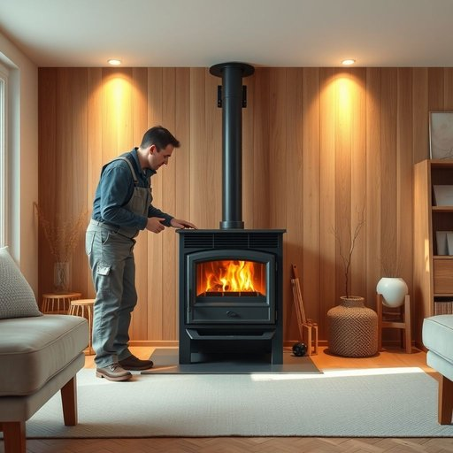

# furnace

<h1 style="font-size: 2.5em; font-weight: 300; letter-spacing: 2px; margin: 0; color: #2c3e50;">
/ˈfərnəs/
</h1>

---

---

## 例句

After noticing that the heating in the living room wasn’t working properly despite turning the thermostat up, she called the maintenance engineer to inspect the furnace, hoping that it wasn’t a major issue like a broken blower or a cracked heat exchanger, which would require expensive repairs or even a complete replacement.

*After(/ˈæftər/) noticing(/ˈnoʊtɪsɪŋ/) that(/ðət/) the(/ðə/) heating(/ˈhitɪŋ/) in(/ɪn/) the(/ðə/) living(/ˈlɪvɪŋ/) room(/rum/) wasn’t(/wasn’t*/) working(/ˈwərkɪŋ/) properly(/ˈprɑpərli/) despite(/dɪˈspaɪt/) turning(/ˈtərnɪŋ/) the(/ðə/) thermostat(/ˈθərməˌstæt/) up,(/əp,/) she(/ʃi/) called(/kɔld/) the(/ðə/) maintenance(/ˈmeɪntənəns/) engineer(/ˈɛnʤəˈnɪr/) to(/tɪ/) inspect(/ˌɪnˈspɛkt/) the(/ðə/) furnace,(/ˈfərnəs,/) hoping(/ˈhoʊpɪŋ/) that(/ðət/) it(/ɪt/) wasn’t(/wasn’t*/) a(/ə/) major(/ˈmeɪʤər/) issue(/ˈɪʃu/) like(/laɪk/) a(/ə/) broken(/ˈbroʊkən/) blower(/bloʊər/) or(/ər/) a(/ə/) cracked(/krækt/) heat(/hit/) exchanger,(/ɪksˈʧeɪnʤər,/) which(/wɪʧ/) would(/wʊd/) require(/ˌrikˈwaɪər/) expensive(/ɪkˈspɛnsɪv/) repairs(/rɪˈpɛrz/) or(/ər/) even(/ˈivɪn/) a(/ə/) complete(/kəmˈplit/) replacement.(/rɪˈpleɪsmənt./)*

**翻译：** 注意到客厅的供暖即使调高了恒温器温度仍然无法正常工作，她便联系了维修工程师来检查炉子，希望问题不是像鼓风机损坏或热交换器裂纹那样严重，否则就需要昂贵的维修甚至整机更换。

---

## 解释

英语单词“furnace”作为名词，主要指用于加热的设备或装置，尤其是在家庭供暖系统中常见的暖炉或炉子。具体使用场合通常是在描述家庭取暖设备时，例如冬季提高室内温度的装置，或工业环境中用于熔炼金属的高温炉。英语学习者需要注意该词通常作为可数名词使用，复数形式为“furnaces”，常见搭配有“central furnace”（中央暖炉）、“gas furnace”（燃气炉）、“wood-burning furnace”（燃木炉）等。此外，“furnace”常与“heat”（热）、“temperature”（温度）、“air circulation”（空气流通）等词搭配出现，表达加热功能。词源方面，“furnace”源自中古英语“fornah”或“fornace”，进一步追溯到拉丁语“fornax”，意为“炉子”或“窑”，体现了该词与加热或熔化过程的紧密联系。从中文语境看，“furnace”准确翻译为“炉子”或“暖炉”，在家居生活中多指家庭采暖用的暖气炉，不含特别的褒义或贬义，属于中性词汇，强调的是其功能性和实用性。文化层面上，在现代家居中“furnace”代表了一种主要的供暖方式，尤其在气候寒冷地区十分常见，是家庭生活舒适度的重要保障。

---

<small style="color: #999; font-size: 0.9em;">2025-07-17 06:22:39</small>

