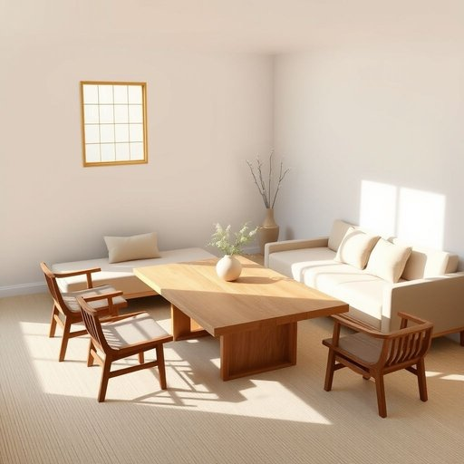

# furniture

<h1 style="font-size: 2.5em; font-weight: 300; letter-spacing: 2px; margin: 0; color: #2c3e50;">
/ˈfərnɪʧər/
</h1>

---

---

## 例句

Although the room was fairly small, the carefully chosen furniture, which included a vintage oak table, a plush velvet sofa, and several intricately carved chairs, transformed the space into a cozy yet elegant living area that instantly made guests feel welcome and at home.

*Although(/ˌɔlˈðoʊ/) the(/ðə/) room(/rum/) was(/wɑz/) fairly(/ˈfɛrli/) small,(/smɔl,/) the(/ðə/) carefully(/ˈkɛrfəli/) chosen(/ˈʧoʊzən/) furniture,(/ˈfərnɪʧər,/) which(/wɪʧ/) included(/ˌɪnˈkludɪd/) a(/ə/) vintage(/ˈvɪntɪʤ/) oak(/oʊk/) table,(/ˈteɪbəl,/) a(/ə/) plush(/pləʃ/) velvet(/ˈvɛlvət/) sofa,(/ˈsoʊfə,/) and(/ənd/) several(/ˈsɛvərəl/) intricately(/ˈɪntrəkətli/) carved(/kɑrvd/) chairs,(/ʧɛrz,/) transformed(/trænsˈfɔrmd/) the(/ðə/) space(/speɪs/) into(/ˈɪntu/) a(/ə/) cozy(/ˈkoʊzi/) yet(/jɛt/) elegant(/ˈɛləgənt/) living(/ˈlɪvɪŋ/) area(/ˈɛriə/) that(/ðət/) instantly(/ˈɪnstəntli/) made(/meɪd/) guests(/gɛsts/) feel(/fil/) welcome(/ˈwɛlkəm/) and(/ənd/) at(/æt/) home.(/hoʊm./)*

**翻译：** 虽然房间相当小巧，但经过精心挑选的家具——包括一张古董橡木桌、一张豪华的天鹅绒沙发以及几把雕工精细的椅子——使空间变得既温馨又雅致，瞬间让客人感受到宾至如归的氛围。

---

## 解释

英语单词“furniture”作为名词，主要指家居生活中用于支撑、存放或布置房间的各种装置和物品，如椅子、桌子、床、柜子等，常见于日常生活、居家环境描述、室内设计和房地产等语境中。学习者需要注意，“furniture”是不可数名词，通常不加复数形式，因此不能说“furnitures”，表示复数时一般使用量词如“pieces of furniture”或“items of furniture”。此外，“furniture”经常与形容词连用，如“wooden furniture”（木制家具）、“antique furniture”（古董家具）或“office furniture”（办公家具）。理解该词时还应注意它涵盖的范围较广，不仅限于单一家具，而是整体家居布置中的设备。词源上，“furniture”源自中古法语“fourniture”，意为“供给、装备”，最早指的是“装备物品”，逐渐专指装修房屋所用的物件。中文中“家具”是其准确翻译，强调的是为居住或生活提供便利和舒适的固定或移动物品，常用于描述家居环境的配置，不带特殊褒贬含义，但在文化层面家具的款式和材质往往反映生活品质和审美取向。此外，英语使用“furniture”不仅局限于家庭，也广泛应用于办公和公共场所，体现功能性的装置和陈设总称。

---

<small style="color: #999; font-size: 0.9em;">2025-07-17 06:22:39</small>

