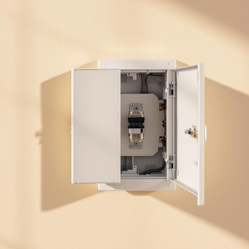

# fuse

<h1 style="font-size: 2.5em; font-weight: 300; letter-spacing: 2px; margin: 0; color: #2c3e50;">
/fjuz/
</h1>

---

---

## 例句

I had to replace the fuse in the fuse box yesterday because the power suddenly went out in the kitchen, and after checking with a multimeter that the faulty fuse was the cause, I carefully swapped it for a new one to ensure all the appliances would work safely again.

*I(/aɪ/) had(/hæd/) to(/tɪ/) replace(/ˌriˈpleɪs/) the(/ðə/) fuse(/fjuz/) in(/ɪn/) the(/ðə/) fuse(/fjuz/) box(/bɑks/) yesterday(/ˈjɛstərˌdeɪ/) because(/bɪˈkəz/) the(/ðə/) power(/paʊər/) suddenly(/ˈsədənli/) went(/wɛnt/) out(/aʊt/) in(/ɪn/) the(/ðə/) kitchen,(/ˈkɪʧən,/) and(/ənd/) after(/ˈæftər/) checking(/ˈʧɛkɪŋ/) with(/wɪθ/) a(/ə/) multimeter(/multimeter*/) that(/ðət/) the(/ðə/) faulty(/ˈfɔlti/) fuse(/fjuz/) was(/wɑz/) the(/ðə/) cause,(/kɔz,/) I(/aɪ/) carefully(/ˈkɛrfəli/) swapped(/swɔpt/) it(/ɪt/) for(/fər/) a(/ə/) new(/nu/) one(/wən/) to(/tɪ/) ensure(/ɪnˈʃʊr/) all(/ɔl/) the(/ðə/) appliances(/əˈplaɪənsɪz/) would(/wʊd/) work(/wərk/) safely(/ˈseɪfli/) again.(/əˈgɛn./)*

**翻译：** 昨天厨房突然停电，我不得不更换配电箱中的保险丝。用万用表确认是保险丝故障后，我小心地将其替换为新的，以确保所有电器能够安全正常运行。

---

## 解释

在家居生活用品的语境中，英语单词“fuse”作为名词，主要指的是电路中的保险丝，是一种用于保护电器或电路安全的元件，能够在电流过大时自动熔断，从而避免电路损坏或火灾等危险。具体使用场合通常出现在家用电器、灯具、配电箱以及各类电器维修和安全说明中，例如“check the fuse if the appliance stops working”（如果电器停止工作，检查保险丝）。学习者需要注意“fuse”作为名词时不可数，通常与特定的短语搭配，如“blown fuse”（烧断的保险丝）、“replace the fuse”（更换保险丝），以及“fuse box”（配电箱，俗称电闸箱）。语法上，“fuse”作为名词在句中常用单数或复数形式“fuses”，但不可与动词形式混淆。此外，“fuse”还有“雷管”或“导火索”等含义，但在家居生活领域主要指保险丝。词源上，“fuse”来自拉丁语“fusus”，意为“熔化”或“融化”，反映了其通过熔断来保护电路的功能。在中文语境中，“fuse”准确翻译为“保险丝”，强调其安全保护作用，属于中性词汇，无褒贬色彩，文化内涵简单直接，主要体现实用与安全保障的意义。

---

<small style="color: #999; font-size: 0.9em;">2025-07-17 06:22:39</small>

