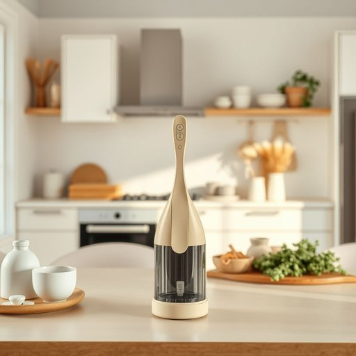

# gadget

<h1 style="font-size: 2.5em; font-weight: 300; letter-spacing: 2px; margin: 0; color: #2c3e50;">
/ˈgæʤət/
</h1>

---

---

## 例句

I was quite surprised when I found that clever little kitchen gadget, which not only slices vegetables with precision but also functions as a peeler and grater, tucked away in the back of our cluttered drawer, proving once again that investing in multifunctional tools can truly save both time and space during meal preparation.

*I(/aɪ/) was(/wɑz/) quite(/kwaɪt/) surprised(/səˈpraɪzd/) when(/wɪn/) I(/aɪ/) found(/faʊnd/) that(/ðət/) clever(/ˈklɛvər/) little(/ˈlɪtəl/) kitchen(/ˈkɪʧən/) gadget,(/ˈgæʤət,/) which(/wɪʧ/) not(/nɑt/) only(/ˈoʊnli/) slices(/sˈlaɪsɪz/) vegetables(/ˈvɛʤtəbəlz/) with(/wɪθ/) precision(/priˈsɪʒən/) but(/bət/) also(/ˈɔlsoʊ/) functions(/ˈfəŋkʃənz/) as(/ɛz/) a(/ə/) peeler(/ˈpilər/) and(/ənd/) grater,(/ˈgreɪtər,/) tucked(/təkt/) away(/əˈweɪ/) in(/ɪn/) the(/ðə/) back(/bæk/) of(/əv/) our(/ɑr/) cluttered(/ˈklətərd/) drawer,(/drɔr,/) proving(/ˈpruvɪŋ/) once(/wəns/) again(/əˈgɛn/) that(/ðət/) investing(/ˌɪnˈvɛstɪŋ/) in(/ɪn/) multifunctional(/ˌməltiˈfəŋkˌʃənəl/) tools(/tulz/) can(/kən/) truly(/ˈtruli/) save(/seɪv/) both(/boʊθ/) time(/taɪm/) and(/ənd/) space(/speɪs/) during(/ˈdʊrɪŋ/) meal(/mil/) preparation.(/ˌprɛpərˈeɪʃən./)*

**翻译：** 当我在杂乱的抽屉深处发现那个巧妙的小厨房工具时，着实感到惊喜。它不仅能精确地切片蔬菜，还具备削皮和擦丝的功能，再次证明投资多功能工具确实能在备餐时节省时间与空间。

---

## 解释

英语单词“gadget”在家居生活用品的语境中作为名词，通常指小巧、实用且具有一定新颖功能的工具或装置，比如厨房里的多功能开瓶器、电子计时器、智能遥控器等。这些物品常用于提高生活便利性或解决特定问题，使用场合多见于家庭日常生活、家务操作或现代智能家居环境中。英语学习者在使用“gadget”时需注意，它通常作为可数名词使用，复数形式为“gadgets”，且多与形容词搭配，如“useful gadget”（有用的小器具）、“kitchen gadget”（厨房小工具）、“electronic gadget”（电子小装置）等，表达时常带有轻松和现代感；此外，“gadget”往往指的是功能专一而设计精巧的设备，而非大件家电。词源方面，“gadget”一词起源于19世纪末，最初含义较为模糊，可能来自法语词汇或港口工人的俚语，早期用来指不知名或难以命名的机械小部件，后来逐渐演变为指小型实用器具。中文中“gadget”一般准确译为“小玩意儿”、“小工具”或“装置”，强调其实用性和创新性，避免翻译成“工具”或“大件设备”以防造成误解。该词本身多带褒义，暗示物品现代、智能、设计巧妙，但在某些语境下也可能带轻微贬义，暗指不必要的花哨装置或过度复杂的用品，故在使用时需根据具体语境判断含义色彩和语气。

---

<small style="color: #999; font-size: 0.9em;">2025-07-17 06:22:39</small>

