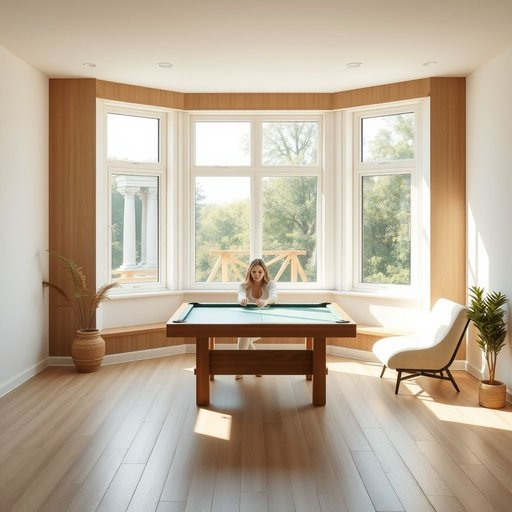

# games-room

<h1 style="font-size: 2.5em; font-weight: 300; letter-spacing: 2px; margin: 0; color: #2c3e50;">
/games-room*/
</h1>

---

---

## 例句

After a long day of work, Sarah loves to retreat to the games-room, where she can unwind by playing a quick round of pool or challenging her brother to a tense game of table tennis, both of which are set up in the corner beneath the large bay window that floods the room with natural light.

*After(/ˈæftər/) a(/ə/) long(/lɔŋ/) day(/deɪ/) of(/əv/) work,(/wərk,/) Sarah(/ˈsɛrə/) loves(/ləvz/) to(/tɪ/) retreat(/riˈtrit/) to(/tɪ/) the(/ðə/) games-room,(/games-room*,/) where(/wɛr/) she(/ʃi/) can(/kən/) unwind(/ənˈwaɪnd/) by(/baɪ/) playing(/pleɪɪŋ/) a(/ə/) quick(/kwɪk/) round(/raʊnd/) of(/əv/) pool(/pul/) or(/ər/) challenging(/ˈʧælənʤɪŋ/) her(/hər/) brother(/ˈbrəðər/) to(/tɪ/) a(/ə/) tense(/tɛns/) game(/geɪm/) of(/əv/) table(/ˈteɪbəl/) tennis,(/ˈtɛnɪs,/) both(/boʊθ/) of(/əv/) which(/wɪʧ/) are(/ər/) set(/sɛt/) up(/əp/) in(/ɪn/) the(/ðə/) corner(/ˈkɔrnər/) beneath(/bɪˈniθ/) the(/ðə/) large(/lɑrʤ/) bay(/beɪ/) window(/ˈwɪndoʊ/) that(/ðət/) floods(/flədz/) the(/ðə/) room(/rum/) with(/wɪθ/) natural(/ˈnæʧərəl/) light.(/laɪt./)*

**翻译：** 忙碌一天后，莎拉喜欢到游戏室放松，她可以打几局快速的台球，或者与弟弟展开一场紧张的乒乓球比赛。两项运动设施都安置在角落里那扇大飘窗下，阳光透过窗户洒满整个房间。

---

## 解释

“games-room”作为名词，指的是家居生活中专门用于娱乐和游戏活动的房间，通常配备有桌上足球、台球、扑克牌桌、电子游戏机等设施，供家庭成员或访客休闲娱乐时使用，具体使用场合多见于描述住宅布局或谈论家庭娱乐空间时，例如在介绍房屋结构、装修设计或日常生活时提到“games-room”表示特意设置的游戏娱乐区域，英语学习者使用该词时需注意它是一个复合名词，通常作为单数使用，复数形式为“games-rooms”，而其拼写中的连字符不可遗漏，作为名词，“games-room”一般用作可数名词，前面可加定冠词the或不定冠词a，常见搭配包括“in the games-room”（在游戏室里）、“a fully equipped games-room”（一间设备齐全的游戏室）等，习惯用法中，“games-room”多用在住宅、学校或俱乐部环境，表达轻松娱乐的空间，其语义中性无特别褒贬，纯粹描述功能用途，词源方面，“games”意为游戏，来自古英语“gamen”，意指娱乐活动，“room”意为房间，源自古英语“rūm”，合成后表示专门用于游戏的房间，中文语境中，“games-room”可译为“游戏室”、“娱乐室”或“休闲室”，准确传达该空间专门用于游戏和娱乐的功能，且在现代生活描述中常作为功能性家居用语出现，无特殊文化色彩，仅强调娱乐休闲的生活品质提升。

---

<small style="color: #999; font-size: 0.9em;">2025-07-17 06:22:39</small>

