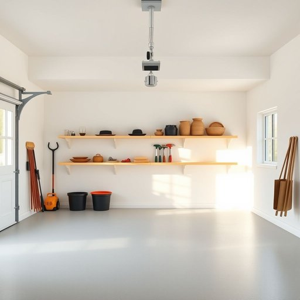

# garage

<h1 style="font-size: 2.5em; font-weight: 300; letter-spacing: 2px; margin: 0; color: #2c3e50;">
/gərɑʒ/
</h1>

---

---

## 例句

After spending the entire morning tidying up the cluttered garage, which had been collecting dust and unused tools for years, the garage finally became a well-organised space that provides enough room for a small workshop and some garden equipment.

*After(/ˈæftər/) spending(/ˈspɛndɪŋ/) the(/ðə/) entire(/ɪnˈtaɪər/) morning(/ˈmɔrnɪŋ/) tidying(/tidying*/) up(/əp/) the(/ðə/) cluttered(/ˈklətərd/) garage,(/gərɑʒ,/) which(/wɪʧ/) had(/hæd/) been(/bɪn/) collecting(/kəˈlɛktɪŋ/) dust(/dəst/) and(/ənd/) unused(/ənˈjuzd/) tools(/tulz/) for(/fər/) years,(/jɪrz,/) the(/ðə/) garage(/gərɑʒ/) finally(/ˈfaɪnəli/) became(/bɪˈkeɪm/) a(/ə/) well-organised(/well-organised*/) space(/speɪs/) that(/ðət/) provides(/prəˈvaɪdz/) enough(/ɪˈnəf/) room(/rum/) for(/fər/) a(/ə/) small(/smɔl/) workshop(/ˈwərkˌʃɑp/) and(/ənd/) some(/səm/) garden(/ˈgɑrdən/) equipment.(/ɪkˈwɪpmənt./)*

**翻译：** 花了整整一个上午整理堆满灰尘和多年未用工具的杂乱车库后，车库终于变成了一个井然有序的空间，足够容纳一个小型工作间和一些园艺设备。

---

## 解释

英语单词“garage”作为名词，在家居生活用品的语境中，特指用来停放汽车的建筑或房间，通常附属于住宅或是独立的结构。具体使用场合多见于描述住宅附属空间，如“park the car in the garage”（把车停在车库里）或“a two-car garage”（一个能停两辆车的车库），表示保护车辆免受天气影响及提供存储空间。英语学习者需注意的是，“garage”作为名词时是可数名词，复数形式为“garages”，且搭配常见短语包括“in the garage”，“a garage door”（车库门），“garage sale”（车库甩卖，指家庭闲置物品的出售活动，具有文化特定含义）。此外，garage还可用作动词，意为“把车停进车库”，但此用法较少见。词源上，“garage”源自法语“garer”，意为“保护、停放”，19世纪末借入英语，最初指为汽车提供停放保护的场所，反映了汽车普及带来的新生活需求。在中文语境中，“garage”通常译为“车库”，为专门为车辆设计的空间，区别于“停车场”（parking lot）及“车棚”等简易结构。注意在翻译时需避免混淆“garage sale”（车库甩卖），这是具有美国文化特色的家庭二手物品出售活动，并非单纯的车库场所。总体来说，“garage”在家居生活中为功能明确的名词，语义中性，无褒贬色彩，反映现代居家生活中车辆管理的重要空间。

---

<small style="color: #999; font-size: 0.9em;">2025-07-17 06:22:39</small>

