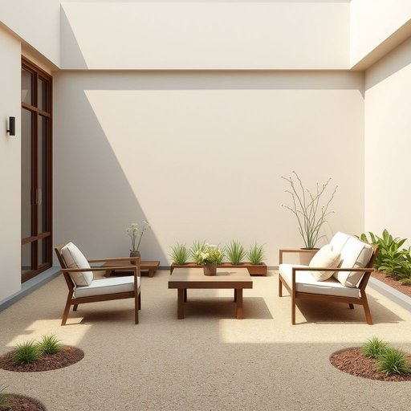

# garden

<h1 style="font-size: 2.5em; font-weight: 300; letter-spacing: 2px; margin: 0; color: #2c3e50;">
/ˈgɑrdən/
</h1>

---

---

## 例句

After spending the entire afternoon planting new flowers and arranging the garden furniture, I finally sat back with a cup of tea to admire how the garden, which had been neglected for months due to my busy schedule, had transformed into a vibrant and inviting space perfect for summer gatherings.

*After(/ˈæftər/) spending(/ˈspɛndɪŋ/) the(/ðə/) entire(/ɪnˈtaɪər/) afternoon(/ˌæftərˈnun/) planting(/ˈplæntɪŋ/) new(/nu/) flowers(/flaʊərz/) and(/ənd/) arranging(/ərˈeɪnʤɪŋ/) the(/ðə/) garden(/ˈgɑrdən/) furniture,(/ˈfərnɪʧər,/) I(/aɪ/) finally(/ˈfaɪnəli/) sat(/sæt/) back(/bæk/) with(/wɪθ/) a(/ə/) cup(/kəp/) of(/əv/) tea(/ti/) to(/tɪ/) admire(/ædˈmaɪr/) how(/haʊ/) the(/ðə/) garden,(/ˈgɑrdən,/) which(/wɪʧ/) had(/hæd/) been(/bɪn/) neglected(/nɪˈglɛktɪd/) for(/fər/) months(/mənθs/) due(/du/) to(/tɪ/) my(/maɪ/) busy(/ˈbɪzi/) schedule,(/ˈskɛʤʊl,/) had(/hæd/) transformed(/trænsˈfɔrmd/) into(/ˈɪntu/) a(/ə/) vibrant(/ˈvaɪbrənt/) and(/ənd/) inviting(/ˌɪnˈvaɪtɪŋ/) space(/speɪs/) perfect(/ˈpərˌfɪkt/) for(/fər/) summer(/ˈsəmər/) gatherings.(/ˈgæðərɪŋz./)*

**翻译：** 整个下午我都在种植新花和摆放花园家具，忙碌后终于端起一杯茶，欣赏着这片因我长时间忙碌而被忽视的花园，如今已经焕然一新，成为一个生机盎然、温馨宜人的空间，非常适合夏日聚会。

---

## 解释

英语单词“garden”作为名词在家居生活用品场景中，通常指住宅附近用于种植花卉、蔬菜或作为休闲场所的户外空间，具体使用场合包括描述房屋附近的绿地、花园布置、园艺活动以及户外家具等场景。学习者在使用“garden”时需注意其作为可数名词，复数形式为“gardens”，且常与介词短语连用，如“in the garden”（在花园里）、“garden tools”（园艺工具）、“garden furniture”（花园家具），常见搭配还有“garden path”（花园小径）、“vegetable garden”（菜园）等，此外，“garden party”是指在花园举办的聚会。语法上，garden主要作名词使用，也可作动词表示“种植花园”，但家居用品语境中多为名词。词源上，“garden”源自古英语“geard”，意为围栏或围地，进一步追溯至原始日耳曼语“gardaz”，带有围绕、界限的含义，这反映了花园作为一块被围绕、规划的土地的本质。在中文语境中，“garden”一般准确译为“花园”或“园地”，指房屋附属的绿化或种植区，与“院子”或“庭院”有所区别，后者更侧重于住宅的整体外部空间，而“garden”强调有植物种植和园艺意味。需要注意的是，“garden”在英文中的文化色彩多为积极、自然和休闲的象征，带有美化生活环境、亲近自然的褒义内涵，通常没有贬义。综上，“garden”在家居生活用品语境中指住宅附属的用于种植和休闲的户外绿地，语法上为可数名词，搭配丰富，词源体现其围绕和界定空间的特征，在中文中宜译作“花园”，反映其种植和美化环境的功能与文化内涵。

---

<small style="color: #999; font-size: 0.9em;">2025-07-17 06:22:39</small>

