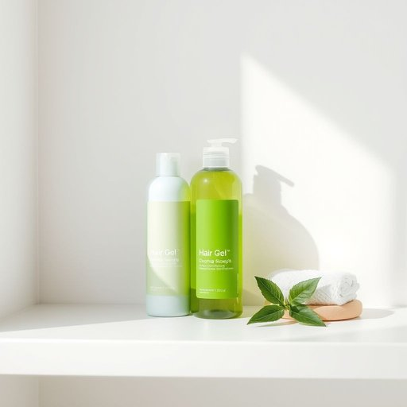

# gel

<h1 style="font-size: 2.5em; font-weight: 300; letter-spacing: 2px; margin: 0; color: #2c3e50;">
/ʤɛl/
</h1>

---

---

## 例句

Could you please pass me the hair gel that’s sitting next to the conditioner on the bathroom shelf, the one with the green label, because I want to style my hair before the guests arrive and make sure it holds well throughout the evening?

*Could(/kʊd/) you(/ju/) please(/pliz/) pass(/pæs/) me(/mi/) the(/ðə/) hair(/hɛr/) gel(/ʤɛl/) that’s(/that’s*/) sitting(/ˈsɪtɪŋ/) next(/nɛkst/) to(/tɪ/) the(/ðə/) conditioner(/kənˈdɪʃənər/) on(/ɔn/) the(/ðə/) bathroom(/ˈbæθˌrum/) shelf,(/ʃɛlf,/) the(/ðə/) one(/wən/) with(/wɪθ/) the(/ðə/) green(/grin/) label,(/ˈleɪbəl,/) because(/bɪˈkəz/) I(/aɪ/) want(/wɔnt/) to(/tɪ/) style(/staɪl/) my(/maɪ/) hair(/hɛr/) before(/ˌbiˈfɔr/) the(/ðə/) guests(/gɛsts/) arrive(/əraɪv/) and(/ənd/) make(/meɪk/) sure(/ʃʊr/) it(/ɪt/) holds(/hoʊldz/) well(/wɛl/) throughout(/θruaʊt/) the(/ðə/) evening?(/ˈivnɪŋ?/)*

**翻译：** 请把浴室架子上护发素旁边那瓶带绿色标签的发胶递给我，我想在客人来之前整理头发，并确保一整晚都能保持定型。

---

## 解释

英语单词“gel”作为名词在家居生活用品场景中，通常指一种具有半固态、胶状质地的物质，如头发造型用的发胶、浴室使用的沐浴凝胶或护肤用的凝胶质产品。使用场合多见于美容、个人护理以及清洁用品的描述中，强调物质的柔软、可塑且能保持一定形态的特点。英语学习者需注意“gel”作为可数名词时通常表示具体的一种凝胶产品，例如“一管凝胶”，而不可数时泛指胶状物质，如“一些凝胶”；此外，“gel with”作为短语用来形容人与人之间关系的和谐，也常见于口语表达中。常见的搭配包括“hair gel”（发胶）、“shower gel”（沐浴露）、“cooling gel”（冷却凝胶）等。词源上，“gel”来自法语“gélée”，意为“冻”，更早源自拉丁语“gelare”，意指“冻结”，反映了其具有较为固定和透明凝固状态的属性。在中文语境中，应准确译为“凝胶”或“胶状物”，特别是指家用美容护理或清洁用品时，多译作“发胶”、“沐浴凝胶”等，避免与“胶水”混淆。该词本身中性，无明显褒贬色彩，但在某些语境中“gel”形容关系“相处融洽”则带有积极评价色彩，并无特殊文化内涵。

---

<small style="color: #999; font-size: 0.9em;">2025-07-17 06:22:39</small>

