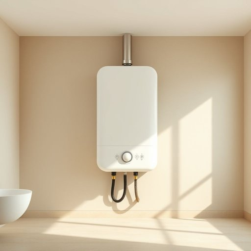

# geyser

<h1 style="font-size: 2.5em; font-weight: 300; letter-spacing: 2px; margin: 0; color: #2c3e50;">
/ˈgaɪzər/
</h1>

---

---

## 例句

I'm not sure whether the geyser, which has been making strange noises for the past week and seems to be leaking slightly near the base, needs a full replacement or if simply adjusting the thermostat and flushing out the sediment will be enough to restore its efficiency before winter arrives.

*I'm(/əm/) not(/nɑt/) sure(/ʃʊr/) whether(/ˈwɛðər/) the(/ðə/) geyser,(/ˈgaɪzər,/) which(/wɪʧ/) has(/həz/) been(/bɪn/) making(/ˈmeɪkɪŋ/) strange(/streɪnʤ/) noises(/ˈnɔɪzɪz/) for(/fər/) the(/ðə/) past(/pæst/) week(/wik/) and(/ənd/) seems(/simz/) to(/tɪ/) be(/bi/) leaking(/ˈlikɪŋ/) slightly(/sˈlaɪtli/) near(/nɪr/) the(/ðə/) base,(/beɪs,/) needs(/nidz/) a(/ə/) full(/fʊl/) replacement(/rɪˈpleɪsmənt/) or(/ər/) if(/ɪf/) simply(/ˈsɪmpli/) adjusting(/əˈʤəstɪŋ/) the(/ðə/) thermostat(/ˈθərməˌstæt/) and(/ənd/) flushing(/ˈfləʃɪŋ/) out(/aʊt/) the(/ðə/) sediment(/ˈsɛdəmənt/) will(/wɪl/) be(/bi/) enough(/ɪˈnəf/) to(/tɪ/) restore(/rɪˈstɔr/) its(/ɪts/) efficiency(/ɪˈfɪʃənsi/) before(/ˌbiˈfɔr/) winter(/ˈwɪntər/) arrives.(/əraɪvz./)*

**翻译：** 我不确定这台过去一周一直发出异响、底部似乎有轻微漏水的热水器，是需要全面更换，还是仅通过调节恒温器并清除沉积物，就能在冬季来临前恢复其效率。

---

## 解释

英语单词“geyser”在家居生活用品的语境中，通常指的是热水器，尤其是在英式英语或南亚地区较为常见的称呼，指用于加热家庭生活用水的设备，如浴室或厨房中的热水器。使用时，常见搭配包括“electric geyser”（电热水器）、“gas geyser”（燃气热水器）等。语法上，“geyser”作为名词，通常作为可数名词使用，单复数形式为“geyser/geysers”，在表达中要注意它是具体物品名词，常与定冠词或数量词连用，如“a geyser in the bathroom”（浴室里的热水器）。此外，学习者应当注意此词在美式英语中较少用作热水器，多指自然喷泉；而在英式英语或印度英语环境下指代热水器较为普遍。词源方面，“geyser”源自冰岛语“geysir”，意指间歇泉，最著名的冰岛“大间歇泉”（The Great Geysir）即为其典型代表。在引申为家居设备名称时，是因其喷射热水的功能与自然间歇喷泉相似而得名。在中文语境中，“geyser”准确翻译为“热水器”或“喷泉”，但在家居生活用品环境下应译作“热水器”，避免理解为自然间歇泉。此词在家居领域中无褒贬色彩，但在不同地区的英语使用习惯有差异，学习时需要结合具体语境使用。

---

<small style="color: #999; font-size: 0.9em;">2025-07-17 06:22:39</small>

