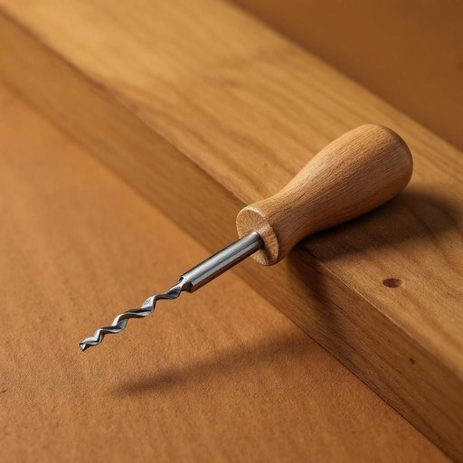

# gimlet

<h1 style="font-size: 2.5em; font-weight: 300; letter-spacing: 2px; margin: 0; color: #2c3e50;">
/ˈgɪmˌlɛt/
</h1>

---

---

## 例句

Could you please pass me the gimlet from the toolbox on the shelf, the one with the worn wooden handle that Dad always uses to precisely drill small pilot holes before assembling any of the furniture, because I need to make sure the screws go in straight without splitting the wood?

*Could(/kʊd/) you(/ju/) please(/pliz/) pass(/pæs/) me(/mi/) the(/ðə/) gimlet(/ˈgɪmˌlɛt/) from(/frəm/) the(/ðə/) toolbox(/ˈtulˌbɔks/) on(/ɔn/) the(/ðə/) shelf,(/ʃɛlf,/) the(/ðə/) one(/wən/) with(/wɪθ/) the(/ðə/) worn(/wɔrn/) wooden(/ˈwʊdən/) handle(/ˈhændəl/) that(/ðət/) Dad(/dæd/) always(/ˈɔlˌweɪz/) uses(/ˈjuzɪz/) to(/tɪ/) precisely(/prɪˈsaɪsli/) drill(/drɪl/) small(/smɔl/) pilot(/ˈpaɪlət/) holes(/hoʊlz/) before(/ˌbiˈfɔr/) assembling(/əˈsɛmbəlɪŋ/) any(/ˈɛni/) of(/əv/) the(/ðə/) furniture,(/ˈfərnɪʧər,/) because(/bɪˈkəz/) I(/aɪ/) need(/nid/) to(/tɪ/) make(/meɪk/) sure(/ʃʊr/) the(/ðə/) screws(/skruz/) go(/goʊ/) in(/ɪn/) straight(/streɪt/) without(/wɪˈθaʊt/) splitting(/ˈsplɪtɪŋ/) the(/ðə/) wood?(/wʊd?/)*

**翻译：** 你能把架子上工具箱里的那个尖钻递给我吗？就是那个带着磨损木柄的，爸爸总是用它在组装家具前精确地钻小导向孔，因为我需要确保螺丝能够垂直入木，不会把木头劈裂。

---

## 解释

英语单词“gimlet”作为名词在家居生活用品领域通常指一种小型手工钻孔工具，也称为卷钻或手摇钻，主要用于木工或其他材料上钻小孔，常见于家具制作或日常修理中。这种工具形状类似小型的螺旋钻头，能够通过旋转进行穿孔，适合精细作业和无电操作的场景。学习者需要注意，“gimlet”作为可数名词时通常指具体的工具本身，常见搭配有“a gimlet to drill holes”（用gimlet钻孔），“hand gimlet”（手动卷钻）等，语法上与一般可数名词一致，单复数形式为“gimlets”。该词起源于中古英语“gimlet”或“gimblet”，可能源自古法语“guimblet”，其进一步来源尚不完全明确，但与旋转钻孔工具的形象关联紧密。中文语境中，gimlet一般被翻译为“卷钻”或“手摇钻”，强调其体积小巧、手持旋转的特点，区别于电钻等现代电动工具。需要注意，在英语中“gimlet”除了指工具外，还有饮料含义（gimlet鸡尾酒），但在家居用品语境下不涉及此义。该词本身无褒贬色彩，更多表现为实用工具名称，无特定文化隐喻。综上，理解gimlet应注重其手工钻孔工具的功能特征及使用场合，避免混淆其他义项。

---

<small style="color: #999; font-size: 0.9em;">2025-07-17 06:22:39</small>

