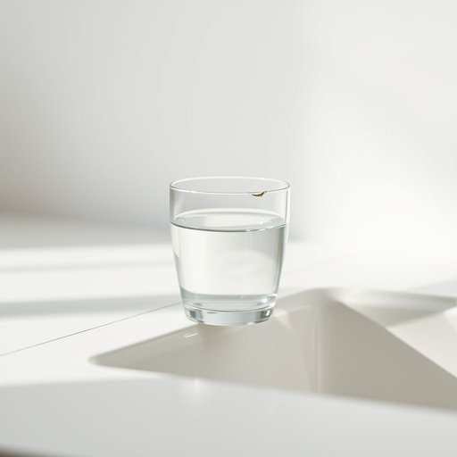

# glass

<h1 style="font-size: 2.5em; font-weight: 300; letter-spacing: 2px; margin: 0; color: #2c3e50;">
/glæs/
</h1>

---

---

## 例句

Could you please pass me the glass that’s been sitting by the sink since this morning, the one with the tiny chip on the rim, so I can fill it up with water before dinner?

*Could(/kʊd/) you(/ju/) please(/pliz/) pass(/pæs/) me(/mi/) the(/ðə/) glass(/glæs/) that’s(/that’s*/) been(/bɪn/) sitting(/ˈsɪtɪŋ/) by(/baɪ/) the(/ðə/) sink(/sɪŋk/) since(/sɪns/) this(/ðɪs/) morning,(/ˈmɔrnɪŋ,/) the(/ðə/) one(/wən/) with(/wɪθ/) the(/ðə/) tiny(/ˈtaɪni/) chip(/ʧɪp/) on(/ɔn/) the(/ðə/) rim,(/rɪm,/) so(/soʊ/) I(/aɪ/) can(/kən/) fill(/fɪl/) it(/ɪt/) up(/əp/) with(/wɪθ/) water(/ˈwɔtər/) before(/ˌbiˈfɔr/) dinner?(/ˈdɪnər?/)*

**翻译：** 请你把那个从今早就放在水槽边、边缘带着一个小缺口的玻璃杯递给我，好让我在晚饭前把它装满水。

---

## 解释

英语单词“glass”作为名词在家居生活用品场景中，主要指用玻璃制成的器皿，尤其是用来喝水、饮料或其他液体的杯子，如“一杯水”或“酒杯”。具体使用时，通常指透明且易碎的材质制品，适用于餐桌、厨房等生活环境。英语学习者需要注意“glass”在单数形式时多指玻璃材料本身或单个玻璃杯，而复数形式“glasses”除了指多个玻璃杯外，还常用作“眼镜”的意思，因此语境判断十分重要。另外，“glass”常搭配的表达有“a glass of + 饮料”、“glass bottle”（玻璃瓶）等，其中“of”是非常典型的介词搭配，用来表示杯子里盛装的内容。词源上，“glass”源自古英语“glæs”，源自日耳曼语系，意为“透明的物质”，其概念伴随玻璃制品的发明和广泛使用而传播开来。在中文中，“glass”在家居用品语境中通常准确翻译为“玻璃杯”或简称“杯子”，强调材质为玻璃，而非其他材质的器皿。需要注意的是，“glass”在日常语言中没有明显的褒贬色彩，但作为玻璃制品，存在易碎性，因此在文化语境中隐含小心使用、安全第一的含义。总体来看，“glass”作为名词在家居用品中是一个相对中性且基础的常用词，正确掌握其语法用法和搭配，有助于英语学习者在日常生活交流中准确表达和理解相关内容。

---

<small style="color: #999; font-size: 0.9em;">2025-07-17 06:22:39</small>

