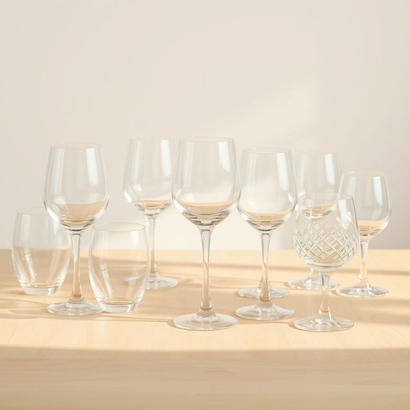

# glassware

<h1 style="font-size: 2.5em; font-weight: 300; letter-spacing: 2px; margin: 0; color: #2c3e50;">
/ˈglæsˌwɛr/
</h1>

---

---

## 例句

Before we set the table for tonight's dinner, could you please unpack the delicate glassware that Mum carefully wrapped in newspaper, making sure none of the wine glasses or tumblers get chipped or cracked during the move?

*Before(/ˌbiˈfɔr/) we(/wi/) set(/sɛt/) the(/ðə/) table(/ˈteɪbəl/) for(/fər/) tonight's(/təˈnaɪts/) dinner,(/ˈdɪnər,/) could(/kʊd/) you(/ju/) please(/pliz/) unpack(/ənˈpæk/) the(/ðə/) delicate(/ˈdɛləkət/) glassware(/ˈglæsˌwɛr/) that(/ðət/) Mum(/məm/) carefully(/ˈkɛrfəli/) wrapped(/ræpt/) in(/ɪn/) newspaper,(/ˈnuzˌpeɪpər,/) making(/ˈmeɪkɪŋ/) sure(/ʃʊr/) none(/nən/) of(/əv/) the(/ðə/) wine(/waɪn/) glasses(/ˈglæsɪz/) or(/ər/) tumblers(/ˈtəmblərz/) get(/gɪt/) chipped(/ʧɪpt/) or(/ər/) cracked(/krækt/) during(/ˈdʊrɪŋ/) the(/ðə/) move?(/muv?/)*

**翻译：** 在我们为今晚的晚餐摆设餐桌之前，你能否帮忙拆开妈妈用报纸小心包裹的精致玻璃器皿，确保在搬运过程中红酒杯和水杯都没有被磕碰或破裂？

---

## 解释

英语单词“glassware”作为家居生活用品领域的名词，主要指由玻璃制成的器皿或用具，如杯子、酒杯、碗、瓶子等，常用于餐饮、储存或装饰场合。具体使用语境多见于厨房、餐厅、宴会、酒吧或装修描述中，如“kitchen glassware”（厨房玻璃器皿）或“wine glassware”（葡萄酒杯具）。学习者在使用时应注意“glassware”是不可数名词，一般不加复数形式，常与限定词搭配如“some glassware”，“a set of glassware”或用作整体概念表达，而非单个物件。它也常与形容词搭配，如“delicate glassware”（精致的玻璃器皿）。词源上，“glassware”由“glass”（玻璃）与后缀“-ware”（器皿，制品）组合而成，表示由玻璃材料制成的器具，跟“tableware”（餐具）、“silverware”（银器）等构词方式类似。中文语境下，“glassware”准确翻译为“玻璃器皿”或“玻璃制品”，侧重指日常使用的玻璃杯具或餐饮相关玻璃用品，无褒贬含义，语义中性，其文化内涵主要与精致生活、餐饮艺术或家庭日用品相关，在正式和非正式场合均可使用。

---

<small style="color: #999; font-size: 0.9em;">2025-07-17 06:22:39</small>

