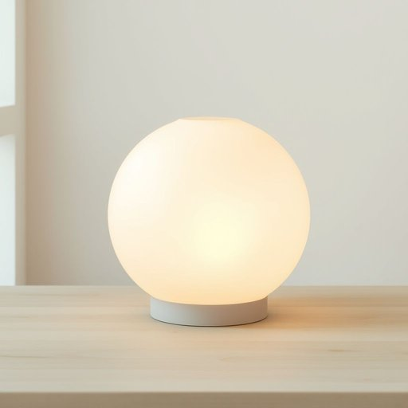

# globe

<h1 style="font-size: 2.5em; font-weight: 300; letter-spacing: 2px; margin: 0; color: #2c3e50;">
/gloʊb/
</h1>

---

---

## 例句

Could you please pass me the antique globe that’s sitting on the bookshelf next to the collection of vintage maps and travel journals, as I want to double-check the exact positioning of the countries we discussed last night before marking them on my itinerary?

*Could(/kʊd/) you(/ju/) please(/pliz/) pass(/pæs/) me(/mi/) the(/ðə/) antique(/ænˈtik/) globe(/gloʊb/) that’s(/that’s*/) sitting(/ˈsɪtɪŋ/) on(/ɔn/) the(/ðə/) bookshelf(/ˈbʊkˌʃɛlf/) next(/nɛkst/) to(/tɪ/) the(/ðə/) collection(/kəˈlɛkʃən/) of(/əv/) vintage(/ˈvɪntɪʤ/) maps(/mæps/) and(/ənd/) travel(/ˈtrævəl/) journals,(/ˈʤərnəlz,/) as(/ɛz/) I(/aɪ/) want(/wɔnt/) to(/tɪ/) double-check(/ˈdəbəˌlʧɛk/) the(/ðə/) exact(/ɪgˈzækt/) positioning(/pəˈzɪʃənɪŋ/) of(/əv/) the(/ðə/) countries(/ˈkəntriz/) we(/wi/) discussed(/dɪˈskəst/) last(/læst/) night(/naɪt/) before(/ˌbiˈfɔr/) marking(/ˈmɑrkɪŋ/) them(/ðɛm/) on(/ɔn/) my(/maɪ/) itinerary?(/aɪˈtɪnərˌɛri?/)*

**翻译：** 您能把放在书架上、靠近那批老旧地图和旅行日志旁的那个古董地球仪递给我吗？我想在把我们昨晚讨论过的那些国家位置标注到行程前，再仔细核对一下它们的准确位置。

---

## 解释

在家居生活用品的语境中，英语单词"globe"作为名词通常指的是灯罩，即覆盖在灯泡外部，用以散射或柔和灯光的圆形或半球形罩子。具体使用场合多见于描述台灯、吊灯、壁灯等家具照明配件时，例如“a glass globe for the ceiling light”（天花板灯的玻璃灯罩）。英语学习者在使用"globe"时应注意其不可与表示地球仪的"globe"混淆，虽然拼写相同但语义不同；此外，作为名词，"globe"一般为单数或复数形式"globes"，其前面通常可加限定词如"a globe"、"the globe"或定语，例如"glass globe"。常见搭配包括"lamp globe"、"glass globe"、"lighting globe"等，这些短语多用于产品描述或购买时。词源上，"globe"源自拉丁语"globus"，意为“球”，最初指球状物体，后来引申为地球仪或球形物，在家居用品中则指形状类似球或半球的罩子。中文环境中，"globe"在家居用品领域被准确译为“灯罩”，更具体可称为“灯泡罩”或“灯泡外罩”，强调其保护灯泡并影响光线的功能。该词在此语境下无褒贬色彩和特殊文化内涵，属于中性词汇，主要侧重于物理形态和功能描述，因而理解时应结合具体产品类型和使用场景。

---

<small style="color: #999; font-size: 0.9em;">2025-07-17 06:22:39</small>

