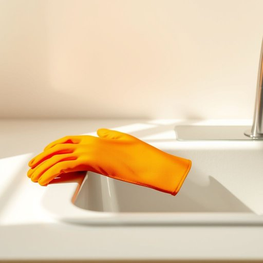

# glove

<h1 style="font-size: 2.5em; font-weight: 300; letter-spacing: 2px; margin: 0; color: #2c3e50;">
/gləv/
</h1>

---

---

## 例句

Before you start washing those stubborn pots and pans, make sure you put on the rubber glove I left by the sink, which not only protects your hands from harsh detergents but also prevents any accidental cuts from broken glass that might be hiding underneath the soapy water.

*Before(/ˌbiˈfɔr/) you(/ju/) start(/stɑrt/) washing(/ˈwɑʃɪŋ/) those(/ðoʊz/) stubborn(/ˈstəbərn/) pots(/pɑts/) and(/ənd/) pans,(/pænz,/) make(/meɪk/) sure(/ʃʊr/) you(/ju/) put(/pʊt/) on(/ɔn/) the(/ðə/) rubber(/ˈrəbər/) glove(/gləv/) I(/aɪ/) left(/lɛft/) by(/baɪ/) the(/ðə/) sink,(/sɪŋk,/) which(/wɪʧ/) not(/nɑt/) only(/ˈoʊnli/) protects(/prəˈtɛkts/) your(/jʊr/) hands(/hænz/) from(/frəm/) harsh(/hɑrʃ/) detergents(/dɪˈtərʤənts/) but(/bət/) also(/ˈɔlsoʊ/) prevents(/prɪˈvɛnts/) any(/ˈɛni/) accidental(/ˌæksəˈdɛnəl/) cuts(/kəts/) from(/frəm/) broken(/ˈbroʊkən/) glass(/glæs/) that(/ðət/) might(/maɪt/) be(/bi/) hiding(/ˈhaɪdɪŋ/) underneath(/ˌəndərˈniθ/) the(/ðə/) soapy(/ˈsoʊpi/) water.(/ˈwɔtər./)*

**翻译：** 在开始清洗那些顽固的锅碗之前，务必戴上我放在水槽旁的橡胶手套，这不仅能保护你的双手免受强力洗涤剂的刺激，还能防止你在泡沫水下意外被碎玻璃划伤。

---

## 解释

英语单词“glove”作为名词在家居生活用品的语境中，主要指的是用于保护手部、保暖或清洁的手套，如厨房手套、清洁手套或保暖手套，通常出现在描述家庭日常生活中的具体情境，比如做饭时使用的隔热手套，打扫卫生时佩戴的橡胶手套等。使用“glove”时，英语学习者应注意其复数形式“gloves”，且通常用于表示一双手套，即左右手都有的配套物品，常见搭配有“一副手套”（a pair of gloves）、“隔热手套”（oven gloves）、“橡胶手套”（rubber gloves）、“工作手套”（work gloves）等，“put on gloves”表示戴上手套，“take off gloves”表示脱下手套，此外，“glove”作为可数名词，不能单独指代手部，需结合具体情境理解。词源方面，“glove”源自古英语“glof”，与其他日耳曼语族语言中的相关词汇同源，最初即指覆盖手的防护物，体现了手套保护功能的历史延续。在中文语境中，“glove”准确翻译为“手套”，泛指各种用途的套在手上的物件，没有特别的褒贬或文化色彩，属于中性词汇，广泛应用于生活、工作及体育等多种场合，使用时应根据具体功能和材质加以细化翻译，如“厨房手套”、“橡胶手套”等，以确保表达准确。

---

<small style="color: #999; font-size: 0.9em;">2025-07-17 06:22:39</small>

