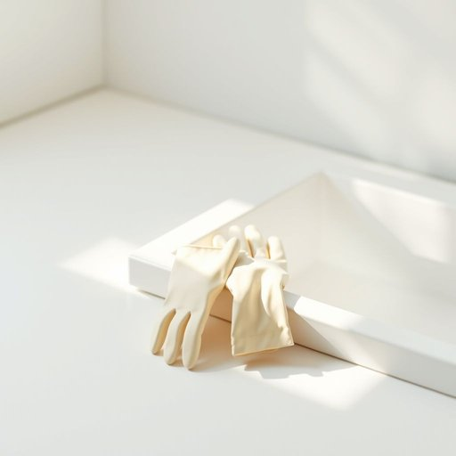

# gloves

<h1 style="font-size: 2.5em; font-weight: 300; letter-spacing: 2px; margin: 0; color: #2c3e50;">
/gləvz/
</h1>

---

---

## 例句

Before you start scrubbing the kitchen floor and tackling the stubborn stains on the countertops, make sure you put on the gloves I left by the sink, as they not only protect your hands from harsh cleaning chemicals but also keep your skin from drying out during the long chore ahead.

*Before(/ˌbiˈfɔr/) you(/ju/) start(/stɑrt/) scrubbing(/ˈskrəbɪŋ/) the(/ðə/) kitchen(/ˈkɪʧən/) floor(/flɔr/) and(/ənd/) tackling(/ˈtækəlɪŋ/) the(/ðə/) stubborn(/ˈstəbərn/) stains(/steɪnz/) on(/ɔn/) the(/ðə/) countertops,(/ˈkaʊntərˌtɑps,/) make(/meɪk/) sure(/ʃʊr/) you(/ju/) put(/pʊt/) on(/ɔn/) the(/ðə/) gloves(/gləvz/) I(/aɪ/) left(/lɛft/) by(/baɪ/) the(/ðə/) sink,(/sɪŋk,/) as(/ɛz/) they(/ðeɪ/) not(/nɑt/) only(/ˈoʊnli/) protect(/prəˈtɛkt/) your(/jʊr/) hands(/hænz/) from(/frəm/) harsh(/hɑrʃ/) cleaning(/ˈklinɪŋ/) chemicals(/ˈkɛmɪkəlz/) but(/bət/) also(/ˈɔlsoʊ/) keep(/kip/) your(/jʊr/) skin(/skɪn/) from(/frəm/) drying(/draɪɪŋ/) out(/aʊt/) during(/ˈdʊrɪŋ/) the(/ðə/) long(/lɔŋ/) chore(/ʧɔr/) ahead.(/əˈhɛd./)*

**翻译：** 在你开始擦洗厨房地板和清理台面上顽固污渍之前，务必戴上我放在水槽旁的手套，它们不仅能保护你的双手免受强力清洁剂的伤害，还能防止你在漫长的清洁过程中皮肤干燥。

---

## 解释

英语单词"gloves"作为名词，在家居生活用品的语境中通常指手套，这是一种覆盖手部的服饰或保护用品，常用于保暖、防护或清洁等场合，比如冬天穿戴的保暖手套、做家务时用的橡胶手套，或厨房里使用的隔热手套。英语学习者在使用该词时需注意，"gloves"是可数名词的复数形式，单数为"glove"，一般不单独使用单数形式表示“手套”这类用品，除非特指一只手套；此外，常见搭配有"wear gloves"（戴手套）、"put on gloves"（戴上手套）、"take off gloves"（脱下手套）、"rubber gloves"（橡胶手套）、"leather gloves"（皮手套）等，表达时多与具体材质或用途搭配以明确含义。"Glove"一词源自古英语"glof"，与中古高地德语"clouf"和古挪威语"glovu"有关，显示了其作为手套的历史渊源，最初指用来保护手部的覆盖物。中文中"gloves"准确翻译为“手套”，涵盖所有材质和用途的手套，不含褒贬色彩，使用时需要根据具体情境确定类型，比如清洁手套常译为“橡胶手套”，保暖手套译为“毛线手套”或“冬季手套”。在家居生活中，这个词没有特殊的文化内涵或隐喻，属于功能性物品的称谓，理解时应重点关注其保护手部、保暖或清洁等实用功能。

---

<small style="color: #999; font-size: 0.9em;">2025-07-17 06:22:39</small>

