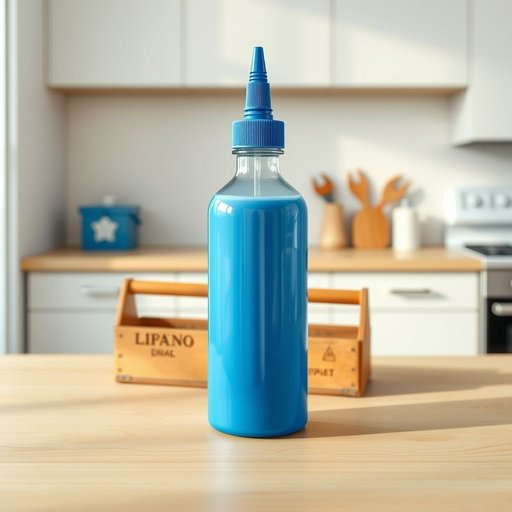

# glue

<h1 style="font-size: 2.5em; font-weight: 300; letter-spacing: 2px; margin: 0; color: #2c3e50;">
/glu/
</h1>

---

---

## 例句

Could you please pass me the glue that’s sitting next to the toolbox on the kitchen counter, the one with the blue cap which I believe is strong enough to fix the broken vase without leaving any visible marks?

*Could(/kʊd/) you(/ju/) please(/pliz/) pass(/pæs/) me(/mi/) the(/ðə/) glue(/glu/) that’s(/that’s*/) sitting(/ˈsɪtɪŋ/) next(/nɛkst/) to(/tɪ/) the(/ðə/) toolbox(/ˈtulˌbɔks/) on(/ɔn/) the(/ðə/) kitchen(/ˈkɪʧən/) counter,(/ˈkaʊntər,/) the(/ðə/) one(/wən/) with(/wɪθ/) the(/ðə/) blue(/blu/) cap(/kæp/) which(/wɪʧ/) I(/aɪ/) believe(/bɪˈliv/) is(/ɪz/) strong(/strɔŋ/) enough(/ɪˈnəf/) to(/tɪ/) fix(/fɪks/) the(/ðə/) broken(/ˈbroʊkən/) vase(/vɑz/) without(/wɪˈθaʊt/) leaving(/ˈlivɪŋ/) any(/ˈɛni/) visible(/ˈvɪzəbəl/) marks?(/mɑrks?/)*

**翻译：** 请把厨房台面工具箱旁边那支带蓝色盖子的胶水递给我，我相信它足够强力，可以修复破碎的花瓶且不会留下明显痕迹。

---

## 解释

英语单词"glue"作为名词在家居生活用品语境中主要指用于粘合物体的黏合剂，常见于修补家具、工艺品制作或家庭DIY项目中。这类“胶水”通常为液体或膏状，能够固定纸张、木材、塑料等多种材料。在具体使用场合上，"glue"常见搭配有“一瓶胶水”（a bottle of glue）、“强力胶水”（strong glue）、“涂胶”（apply glue）等，学习者应注意其不可数名词属性，但在指具体种类或包装时可用可数形式。在语法使用上，“glue”作为名词时通常不用复数形式，且常与介词“with”搭配表示“用胶水粘合”，例如“stick the paper with glue”。词源方面，“glue”源自中古英语“glew”，进而来源于古法语“glu”，最终可追溯至拉丁语“glū”或希腊语“kolla”，意指天然树脂或动物胶，体现了其作为黏合剂的传统用途。在中文语境中，“glue”准确翻译为“胶水”，强调其用于粘合物品的功能，不含褒贬色彩，属于中性词汇，通常与修补、固定等正面家庭生活行为相关联。使用时无需担心特殊文化隐喻或禁忌，词义直白且应用广泛。

---

<small style="color: #999; font-size: 0.9em;">2025-07-17 06:22:39</small>

