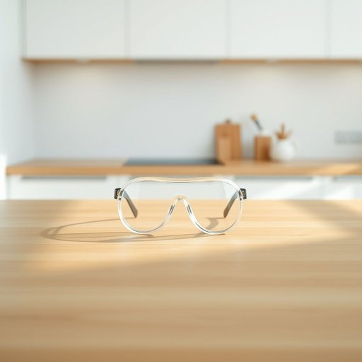

# goggles

<h1 style="font-size: 2.5em; font-weight: 300; letter-spacing: 2px; margin: 0; color: #2c3e50;">
/ˈgɑgəlz/
</h1>

---

---

## 例句

Before you start mixing those strong cleaning chemicals in the kitchen sink, make sure you put on the goggles I left on the countertop, because they’ll protect your eyes from any unexpected splashes or fumes that could cause irritation.

*Before(/ˌbiˈfɔr/) you(/ju/) start(/stɑrt/) mixing(/ˈmɪksɪŋ/) those(/ðoʊz/) strong(/strɔŋ/) cleaning(/ˈklinɪŋ/) chemicals(/ˈkɛmɪkəlz/) in(/ɪn/) the(/ðə/) kitchen(/ˈkɪʧən/) sink,(/sɪŋk,/) make(/meɪk/) sure(/ʃʊr/) you(/ju/) put(/pʊt/) on(/ɔn/) the(/ðə/) goggles(/ˈgɑgəlz/) I(/aɪ/) left(/lɛft/) on(/ɔn/) the(/ðə/) countertop,(/ˈkaʊntərˌtɑp,/) because(/bɪˈkəz/) they’ll(/they’ll*/) protect(/prəˈtɛkt/) your(/jʊr/) eyes(/aɪz/) from(/frəm/) any(/ˈɛni/) unexpected(/ˌənɪkˈspɛktɪd/) splashes(/ˈsplæʃɪz/) or(/ər/) fumes(/fjumz/) that(/ðət/) could(/kʊd/) cause(/kɔz/) irritation.(/ˌɪrɪˈteɪʃən./)*

**翻译：** 在你开始在厨房水槽里混合那些强力清洁剂之前，务必戴上我放在台面上的护目镜，因为它们能保护你的眼睛，避免意外飞溅或蒸汽带来的刺激。

---

## 解释

英语单词“goggles”作为名词在家居生活用品场景中，通常指代护目镜或防护眼镜，主要用于保护眼睛免受水、化学品、灰尘或强光伤害的用品，例如游泳眼镜、实验室用防护眼镜或家庭装修时使用的防护眼镜等。具体使用场合包括游泳时佩戴防水护眼，进行清洁或使用化学品时防止液体飞溅，或DIY装修时防止灰尘和碎屑进入眼睛。对于英语学习者，“goggles”是复数形式名词，通常不用于单数，因为单只眼镜往往用“goggle”较少见且不常使用，注意其复数形式和搭配常用表达如“wear goggles”（戴护目镜）、“swimming goggles”（游泳护目镜）、“safety goggles”（安全护目镜），在构造表达时多与形容词连用以说明用途或类别，如“protective goggles”。词源上，“goggles”源自中世纪英语，可能与“goggling”（指眼睛突出或瞪视）有关，体现戴眼镜时的突出形态，作为现代词汇主要指眼部防护用具。在中文语境中，“goggles”准确翻译为“护目镜”或“防护眼镜”，强调其保护眼睛的功能而非普通眼镜，理解时应避免与普通眼镜混淆，通常指具有防护功能的专用眼镜。该词无明显褒贬色彩，属于中性名词，但在文化或语言环境中有时象征安全意识或专业防护意识。

---

<small style="color: #999; font-size: 0.9em;">2025-07-17 06:22:40</small>

