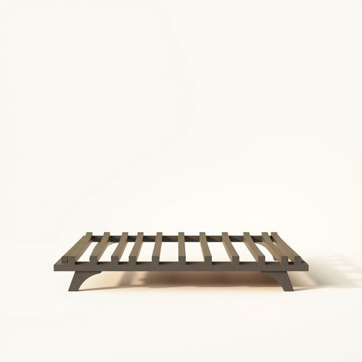

# grate

<h1 style="font-size: 2.5em; font-weight: 300; letter-spacing: 2px; margin: 0; color: #2c3e50;">
/greɪt/
</h1>

---

---

## 例句

Could you please clean the fireplace grate thoroughly before we start burning the logs tonight, since the buildup of ash and soot not only blocks the airflow but also makes it difficult to light a fire efficiently?

*Could(/kʊd/) you(/ju/) please(/pliz/) clean(/klin/) the(/ðə/) fireplace(/ˈfaɪərˌpleɪs/) grate(/greɪt/) thoroughly(/ˈθəroʊli/) before(/ˌbiˈfɔr/) we(/wi/) start(/stɑrt/) burning(/ˈbərnɪŋ/) the(/ðə/) logs(/lɔgz/) tonight,(/təˈnaɪt,/) since(/sɪns/) the(/ðə/) buildup(/ˈbɪlˌdəp/) of(/əv/) ash(/æʃ/) and(/ənd/) soot(/sʊt/) not(/nɑt/) only(/ˈoʊnli/) blocks(/blɑks/) the(/ðə/) airflow(/ˈɛrfloʊ/) but(/bət/) also(/ˈɔlsoʊ/) makes(/meɪks/) it(/ɪt/) difficult(/ˈdɪfəkəlt/) to(/tɪ/) light(/laɪt/) a(/ə/) fire(/faɪər/) efficiently?(/ɪˈfɪʃəntli?/)*

**翻译：** 在今晚开始点柴火之前，能否请您彻底清理一下壁炉的炉格？因为积聚的灰烬和烟尘不仅阻碍了空气流通，也使点火变得困难且效率低下。

---

## 解释

英语单词“grate”作为名词在家居生活用品场景中通常指的是用于壁炉、火炉或炉灶上的“炉篦”或“炉栅”，即那种金属制成的格栅结构，用来放置燃料（如木柴或煤炭），使空气能够从下方流通，帮助燃烧更加充分和安全，常见于传统的家居取暖设备中。使用时语境多为描述采暖设备的组成部分或维修、更换相关部件，如“clean the grate”（清理炉栅）或“replace the grate”（更换炉篦）。英语学习者需要注意，作为名词的“grate”多是可数名词，通常用复数形式“grates”表示多片炉栅，同时它还有动词用法（使磨碎或使烦恼），在家居用品语境中应避免混淆。常见搭配有“fire grate”或“hearth grate”，指壁炉中的炉栅。词源上，“grate”来源于古法语“grater”，与中世纪拉丁语“cratis”相关，原意为“格子”或“栅栏”，反映其作为网状结构的特征。在中文语境中，此词最准确的译法是“炉篦”或“炉栅”，明确指代壁炉中用于置放燃料的金属格栅，与一般的“格栅”或“铁栅栏”不同，具有专业性且局限于采暖或烹饪设备。该词本身无明显褒贬色彩或文化内涵，属于中性名词，理解时应结合具体的家居采暖或炉具语境，避免将其与厨房用具如擦丝器（grater）混淆。

---

<small style="color: #999; font-size: 0.9em;">2025-07-17 06:22:40</small>

