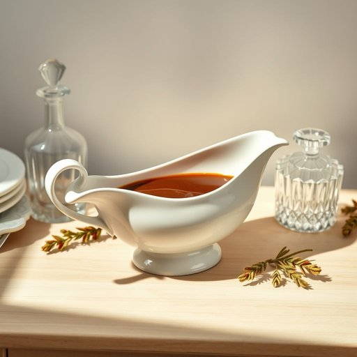

# gravy-boat

<h1 style="font-size: 2.5em; font-weight: 300; letter-spacing: 2px; margin: 0; color: #2c3e50;">
/gravy-boat*/
</h1>

---

---

## 例句

Could you please pass me the gravy-boat that’s sitting on the sideboard next to the crystal decanter, as I’d like to pour some rich, homemade gravy over the roast before everyone starts serving themselves?

*Could(/kʊd/) you(/ju/) please(/pliz/) pass(/pæs/) me(/mi/) the(/ðə/) gravy-boat(/gravy-boat*/) that’s(/that’s*/) sitting(/ˈsɪtɪŋ/) on(/ɔn/) the(/ðə/) sideboard(/sideboard*/) next(/nɛkst/) to(/tɪ/) the(/ðə/) crystal(/ˈkrɪstəl/) decanter,(/decanter*,/) as(/ɛz/) I’d(/i’d*/) like(/laɪk/) to(/tɪ/) pour(/pɔr/) some(/səm/) rich,(/rɪʧ,/) homemade(/ˈhoʊˈmeɪd/) gravy(/ˈgreɪvi/) over(/ˈoʊvər/) the(/ðə/) roast(/roʊst/) before(/ˌbiˈfɔr/) everyone(/ˈɛvriˌwən/) starts(/stɑrts/) serving(/ˈsərvɪŋ/) themselves?(/ðɛmˈsɛlvz?/)*

**翻译：** 你能把放在餐边柜水晶酒瓶旁的酱汁船递给我吗？我想在大家开始自取烤肉之前，先淋上一些浓郁的自制肉汁。

---

## 解释

“gravy-boat”作为名词，指的是一种家居餐具，通常用来盛装肉汁、酱汁等液态调味料的容器，其形状类似小船，带有一端开口和流嘴，便于倒出酱汁。具体使用场合多见于正式或家庭餐桌上，当人们需要添加酱汁以增添食物风味时使用，如感恩节或圣诞节等节日宴会中常见。英语学习者在使用此词时，要注意它是个可数名词，通常与定冠词the连用，如“pass the gravy-boat”，也常与名词“sauce”或“gravy”搭配，如“a gravy-boat full of gravy”，除此之外，作为复合词，“gravy-boat”复数形式为“gravy-boats”，拼写时需注意连字符的使用。该词源于英语单词“gravy”（肉汁）和“boat”（船），形象地反映了其似船形的盛装器皿设计，这一使用起源可以追溯到18世纪西方饮食文化中对餐桌礼仪容器的改良。中文语境中，“gravy-boat”准确翻译为“肉汁船”或“酱汁船”，指专门盛装酱汁的小器皿，体现了功能性和形态特点，无贬义或褒义色彩，属于中性词汇，主要强调其实用性和餐桌美观效果，在描述家庭或宴会用餐环境时较为常见。

---

<small style="color: #999; font-size: 0.9em;">2025-07-17 06:22:40</small>

