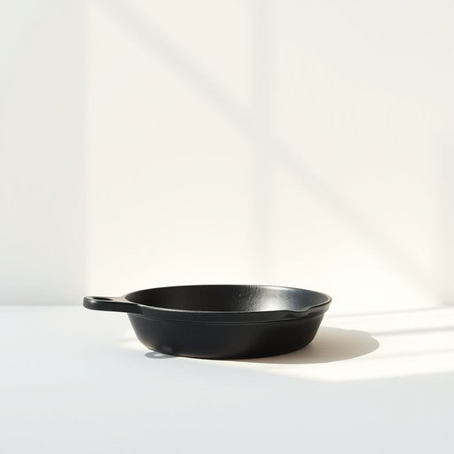

# griddle

<h1 style="font-size: 2.5em; font-weight: 300; letter-spacing: 2px; margin: 0; color: #2c3e50;">
/griddle*/
</h1>

---

---

## 例句

The textbook, which was heavily annotated by former students and filled with complex diagrams, became an invaluable resource in the professor’s efforts to illustrate the intricate theories during the lecture.

*The(/ðə/) textbook,(/ˈtɛkstˌbʊk,/) which(/wɪʧ/) was(/wɑz/) heavily(/ˈhɛvəli/) annotated(/ˌænəˈteɪtɪd/) by(/baɪ/) former(/ˈfɔrmər/) students(/ˈstudənts/) and(/ənd/) filled(/fɪld/) with(/wɪθ/) complex(/ˈkɑmplɛks/) diagrams,(/ˈdaɪəˌgræmz,/) became(/bɪˈkeɪm/) an(/ən/) invaluable(/ˌɪnˈvæljəbəl/) resource(/ˈrisɔrs/) in(/ɪn/) the(/ðə/) professor’s(/professor’s*/) efforts(/ˈɛfərts/) to(/tɪ/) illustrate(/ˈɪləˌstreɪt/) the(/ðə/) intricate(/ˈɪntrəkət/) theories(/ˈθɪriz/) during(/ˈdʊrɪŋ/) the(/ðə/) lecture.(/ˈlɛkʧər./)*

**翻译：** 这本教科书曾被前辈学生大量批注，书中充满了复杂的图表，成为教授在讲授时演示复杂理论的重要资源。

---

## 解释

英语单词“griddle”作为名词在家居生活用品场景中，指的是一种平坦的烹饪器具，多为铁质或不粘材质，通常放在炉子上或配有独立加热装置，用于煎烤食品如煎饼、鸡蛋、培根等，使用场合多见于厨房烹饪活动中。英语学习者在使用“griddle”时需注意其为可数名词，常见搭配有“a cast-iron griddle”（铸铁烤盘）、“electric griddle”（电烤盘）、“cook on the griddle”（在烤盘上烹饪），表达时多用作具体物品，且常与动词“cook”、“heat”、“clean”等搭配。此外，“griddle”与“grill”虽有相似用途，但前者表面平坦，后者通常带有条纹，语义上需区分。该词源自中古英语“gredil”，可能来自盎格鲁-诺曼法语“gredil”，意指金属平板，且与拉丁语“craticula”相关，体现了其作为烹饪平板工具的历史沿袭。在中文语境中，“griddle”通常翻译为“烤盘”或“煎盘”，强调其平板且适合煎烤的功能特点，避免与烧烤架等其他器具混淆。该词无特殊褒贬色彩或文化负载，属中性词汇，主要侧重实用厨房器具含义，适合日常生活中描述特定烹饪工具。

---

<small style="color: #999; font-size: 0.9em;">2025-07-17 06:22:40</small>

