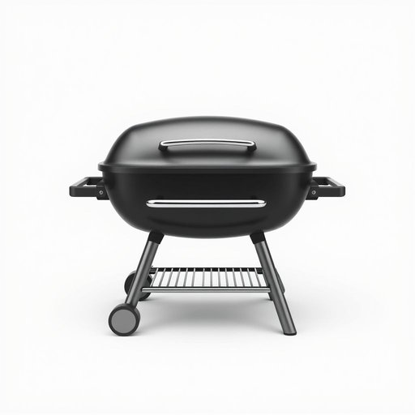

# grill

<h1 style="font-size: 2.5em; font-weight: 300; letter-spacing: 2px; margin: 0; color: #2c3e50;">
/grɪl/
</h1>

---

---

## 例句

Despite the unpredictable weather and the fact that I forgot to clean the grill last weekend, I still managed to marinate the chicken properly, but the food ended up sticking and tasting a bit burnt, so I’ll definitely make sure to give it a thorough scrub before our next barbecue.

*Despite(/dɪˈspaɪt/) the(/ðə/) unpredictable(/ˌənprɪˈdɪktəbəl/) weather(/ˈwɛðər/) and(/ənd/) the(/ðə/) fact(/fækt/) that(/ðət/) I(/aɪ/) forgot(/fərˈgɑt/) to(/tɪ/) clean(/klin/) the(/ðə/) grill(/grɪl/) last(/læst/) weekend,(/ˈwiˌkɪnd,/) I(/aɪ/) still(/stɪl/) managed(/ˈmænɪʤd/) to(/tɪ/) marinate(/ˈmɛrəˌneɪt/) the(/ðə/) chicken(/ˈʧɪkən/) properly,(/ˈprɑpərli,/) but(/bət/) the(/ðə/) food(/fud/) ended(/ˈɛndɪd/) up(/əp/) sticking(/ˈstɪkɪŋ/) and(/ənd/) tasting(/ˈteɪstɪŋ/) a(/ə/) bit(/bɪt/) burnt,(/bərnt,/) so(/soʊ/) I’ll(/i’ll*/) definitely(/ˈdɛfənətli/) make(/meɪk/) sure(/ʃʊr/) to(/tɪ/) give(/gɪv/) it(/ɪt/) a(/ə/) thorough(/θəroʊ/) scrub(/skrəb/) before(/ˌbiˈfɔr/) our(/ɑr/) next(/nɛkst/) barbecue.(/ˈbɑrbɪˌkju./)*

**翻译：** 尽管天气变化无常，而且我上周末忘了清洗烤架，但我还是成功地把鸡肉腌制好了。不过，食物最终粘在了烤架上，味道也有些焦，所以我一定会在下一次烧烤前彻底清理干净。

---

## 解释

英语单词“grill”作为名词在家居生活用品场景中，通常指一种用于烧烤或烤制食物的厨房器具或设备，如电烧烤炉、烤架、烤盘等。具体使用场合常见于描述烹饪过程，比如“turn on the grill”（打开烤架）或者“cook the meat on the grill”（在烤架上烤肉）。英语学习者需要注意，“grill”作为名词时通常可数，且常与动词“use”、“turn on”、“clean”等搭配，此外，“grill”还可作动词使用，意为“烧烤”、“烤制”。语法上，“grill”名词后可以接表明具体特征的名词构成短语，如“barbecue grill”（烧烤架）。词源上，“grill”来自中古法语“grille”，源自拉丁语“craticula”，意指金属架或烤架，反映其用于放置食物加热的功能。在中文语境中，“grill”多译为“烤架”、“烧烤炉”或“烤盘”，强调其作为烹饪工具的实物属性，没有特殊的褒贬色彩或语言情感，但在英语文化中，提及“grill”也常与户外烧烤、休闲活动相关联，具有一定的生活休闲氛围。总之，“grill”作为名词是在家居厨房或户外烧烤情境中指代烤制食物的器具，学习时需关注其可数名词用法及与烹饪动作的搭配，准确理解其物理设备属性。

---

<small style="color: #999; font-size: 0.9em;">2025-07-17 06:22:40</small>

