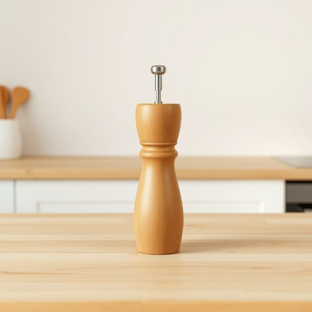

# grinder

<h1 style="font-size: 2.5em; font-weight: 300; letter-spacing: 2px; margin: 0; color: #2c3e50;">
/ˈgraɪndər/
</h1>

---

---

## 例句

I was rummaging through the kitchen cupboards because, after realizing that the old pepper grinder had finally stopped working due to the worn-out mechanism, I needed to find a suitable replacement that not only looked elegant but also ground spices efficiently; otherwise, my dishes would lack the freshly cracked flavor that only a quality grinder can provide.

*I(/aɪ/) was(/wɑz/) rummaging(/ˈrəmɪʤɪŋ/) through(/θru/) the(/ðə/) kitchen(/ˈkɪʧən/) cupboards(/ˈkəbərdz/) because,(/bɪˈkəz,/) after(/ˈæftər/) realizing(/ˈriəˌlaɪzɪŋ/) that(/ðət/) the(/ðə/) old(/oʊld/) pepper(/ˈpɛpər/) grinder(/ˈgraɪndər/) had(/hæd/) finally(/ˈfaɪnəli/) stopped(/stɑpt/) working(/ˈwərkɪŋ/) due(/du/) to(/tɪ/) the(/ðə/) worn-out(/worn-out*/) mechanism,(/ˈmɛkəˌnɪzəm,/) I(/aɪ/) needed(/ˈnidɪd/) to(/tɪ/) find(/faɪnd/) a(/ə/) suitable(/ˈsutəbəl/) replacement(/rɪˈpleɪsmənt/) that(/ðət/) not(/nɑt/) only(/ˈoʊnli/) looked(/lʊkt/) elegant(/ˈɛləgənt/) but(/bət/) also(/ˈɔlsoʊ/) ground(/graʊnd/) spices(/ˈspaɪsɪz/) efficiently;(/ɪˈfɪʃəntli;/) otherwise,(/ˈəðərˌwaɪz,/) my(/maɪ/) dishes(/ˈdɪʃɪz/) would(/wʊd/) lack(/læk/) the(/ðə/) freshly(/ˈfrɛʃli/) cracked(/krækt/) flavor(/ˈfleɪvər/) that(/ðət/) only(/ˈoʊnli/) a(/ə/) quality(/kˈwɑləti/) grinder(/ˈgraɪndər/) can(/kən/) provide.(/prəˈvaɪd./)*

**翻译：** 我正翻找厨房橱柜，因为那把旧胡椒研磨器终于因磨损而停止工作了，我需要找到一个既外观优雅又能高效研磨香料的替代品，否则我的菜肴将缺少只有高品质研磨器才能带来的新鲜现磨风味。

---

## 解释

英语单词“grinder”作为家居生活用品中的名词，通常指用于研磨或切碎食物的工具或机器，如咖啡研磨机、胡椒研磨器或肉类绞肉机，常见于厨房环境中，帮助将固体食材加工成细小颗粒或粉末，方便烹饪或调味。在具体使用时，英语学习者应注意该词为可数名词，可以直接用作单数或复数形式，例如“一台咖啡研磨机”或“几台绞肉机”；此外，常见的搭配有“电动研磨机”、“手动研磨器”、“胡椒研磨器”，这些短语帮助明确工具的类型和使用方式。词源上，“grinder”源自动词“grind”（研磨、碾碎）加上名词后缀“-er”，表示执行该动作的工具或人，起源可以追溯到中古英语时期，与磨碎谷物或其他物质的传统工具相关联。在中文语境中，准确翻译为“研磨机”、“磨碎机”或“绞肉机”等，根据具体用途不同而有所区别，通常理解为厨房中用来研磨、切碎食材的器具。在日常表达中，“grinder”一般是中性词，无明显褒贬色彩，但在某些行业或文化背景下，也可引申为辛勤努力的人（如“hard grinder”意指勤劳刻苦之人），但此含义并不常用于家居生活语境。总的来说，理解“grinder”在家居生活用品中的含义，应结合具体的食材加工功能、机械或手动操作形式以及相关搭配词汇，确保准确表达和理解。

---

<small style="color: #999; font-size: 0.9em;">2025-07-17 06:22:40</small>

