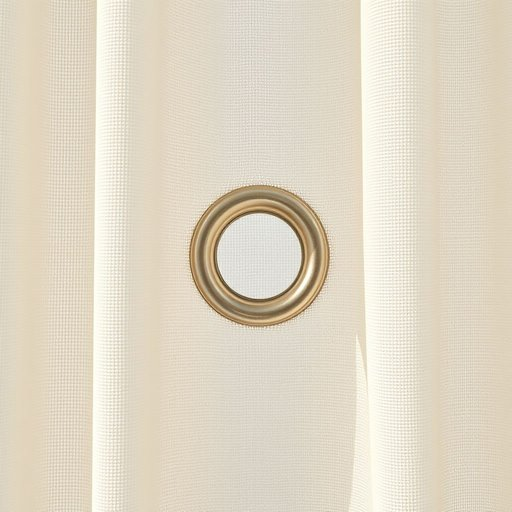

# grommet

<h1 style="font-size: 2.5em; font-weight: 300; letter-spacing: 2px; margin: 0; color: #2c3e50;">
/grommet*/
</h1>

---

---

## 例句

Before we hang the new curtains, make sure to fit the grommets securely through the curtain rod so that the fabric slides smoothly, as poorly installed grommets can cause the curtains to snag or hang unevenly, which not only looks untidy but might also wear out the material prematurely.

*Before(/ˌbiˈfɔr/) we(/wi/) hang(/hæŋ/) the(/ðə/) new(/nu/) curtains,(/ˈkərtənz,/) make(/meɪk/) sure(/ʃʊr/) to(/tɪ/) fit(/fɪt/) the(/ðə/) grommets(/grommets*/) securely(/sɪˈkjʊrli/) through(/θru/) the(/ðə/) curtain(/ˈkərtən/) rod(/rɑd/) so(/soʊ/) that(/ðət/) the(/ðə/) fabric(/ˈfæbrɪk/) slides(/slaɪdz/) smoothly,(/sˈmuðli,/) as(/ɛz/) poorly(/ˈpurli/) installed(/ˌɪnˈstɔld/) grommets(/grommets*/) can(/kən/) cause(/kɔz/) the(/ðə/) curtains(/ˈkərtənz/) to(/tɪ/) snag(/snæg/) or(/ər/) hang(/hæŋ/) unevenly,(/əˈnivənli,/) which(/wɪʧ/) not(/nɑt/) only(/ˈoʊnli/) looks(/lʊks/) untidy(/ənˈtaɪdi/) but(/bət/) might(/maɪt/) also(/ˈɔlsoʊ/) wear(/wɛr/) out(/aʊt/) the(/ðə/) material(/məˈtɪriəl/) prematurely.(/ˌpriməˈʧʊrli./)*

**翻译：** 在挂新窗帘之前，请确保将金属环牢固地套在窗帘杆上，以便布料能够顺畅滑动。安装不当的金属环不仅可能导致窗帘挂歪或卡住，影响美观，还可能加速面料的磨损。

---

## 解释

英语单词“grommet”在家居生活用品语境中作为名词，通常指的是一种小型环形金属或塑料衬圈，用于加固布料、帆布、窗帘或塑料制品上的孔洞，防止孔洞撕裂或磨损，常见于窗帘的挂孔、遮阳篷、帐篷或电线穿孔处。使用时，多出现在描述窗帘安装、家具布料维护或装修装饰等场合，如“curtain grommets”（窗帘圈）或“wire grommets”（电线圈）。英语学习者在使用该词时需注意其作为可数名词的用法，单复数形式分别是“grommet”和“grommets”，常与名词或形容词搭配使用，如“metal grommet”、“plastic grommet”或“install grommets”；表达时多涉及“fit/install/replace grommets”等动词短语。词源上，“grommet”一词起源于14世纪末，最初在航海领域指小金属环，后因其固定和加固功能被引申至日常生活用品中，体现其保护孔洞不被磨损的作用。在中文语境中，“grommet”可准确翻译为“金属衬圈”或“护圈”，其核心含义为保护或加固孔洞的小环，没有褒义或贬义，属于中性工具术语，理解时应与具体物品相结合，避免混淆为其他同音词或引申义。在家居领域，熟悉“grommet”有助于理解和描述装修材料及安装细节，是实用的专业术语。

---

<small style="color: #999; font-size: 0.9em;">2025-07-17 06:22:40</small>

