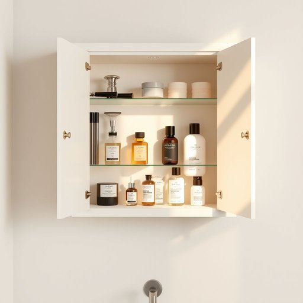

# grooming

<h1 style="font-size: 2.5em; font-weight: 300; letter-spacing: 2px; margin: 0; color: #2c3e50;">
/ˈgrumɪŋ/
</h1>

---

---

## 例句

In the bathroom cupboard, I keep a dedicated set of grooming products, including a high-quality shaving kit, a selection of scented aftershaves, and a range of moisturizers, all of which are essential not only for maintaining a polished appearance but also for ensuring skin health during the colder months.

*In(/ɪn/) the(/ðə/) bathroom(/ˈbæθˌrum/) cupboard,(/ˈkəbərd,/) I(/aɪ/) keep(/kip/) a(/ə/) dedicated(/ˈdɛdəkeɪtəd/) set(/sɛt/) of(/əv/) grooming(/ˈgrumɪŋ/) products,(/ˈprɑdəkts,/) including(/ˌɪnˈkludɪŋ/) a(/ə/) high-quality(/ˌhaɪkˈwɑləti/) shaving(/ˈʃeɪvɪŋ/) kit,(/kɪt,/) a(/ə/) selection(/səˈlɛkʃən/) of(/əv/) scented(/ˈsɛntɪd/) aftershaves,(/ˌæftərˈʃeɪvz,/) and(/ənd/) a(/ə/) range(/reɪnʤ/) of(/əv/) moisturizers,(/moisturizers*,/) all(/ɔl/) of(/əv/) which(/wɪʧ/) are(/ər/) essential(/ɛˈsɛnʃəl/) not(/nɑt/) only(/ˈoʊnli/) for(/fər/) maintaining(/meɪnˈteɪnɪŋ/) a(/ə/) polished(/ˈpɑlɪʃt/) appearance(/əˈpɪrəns/) but(/bət/) also(/ˈɔlsoʊ/) for(/fər/) ensuring(/ɪnˈʃʊrɪŋ/) skin(/skɪn/) health(/hɛlθ/) during(/ˈdʊrɪŋ/) the(/ðə/) colder(/ˈkoʊldər/) months.(/mənθs./)*

**翻译：** 浴室的橱柜里，我专门存放了一套护理用品，包括一套高品质的刮胡套装、一些香氛须后水以及多种保湿霜，这些不仅对保持整洁的外观至关重要，更能在寒冷的季节保护皮肤健康。

---

## 解释

英语单词“grooming”在家居生活用品场景中作为名词，通常指的是个人清洁和美容护理的行为或过程，如梳理头发、修剪指甲、面部清洁等，用以保持个人整洁和美观。具体使用场合多见于描述日常护理习惯、介绍美容产品功能或说明个人护理程序时，例如“daily grooming routine”（日常护理程序）或“grooming kit”（护理工具套装）。英语学习者在使用该词时应注意“grooming”作为不可数名词时侧重过程或行为，而作为可数名词时则多指一套护理用品或工具；常见搭配包括“personal grooming”（个人护理）、“male grooming”（男性护理）等，表达时常与表示身体部位或护理步骤的词汇连用。词源上，“groom”最初源自中古英语，意为“照料”或“打理”（尤其指马匹），后延伸至对人进行整饰和护理的含义，体现从动物护理到人类个人护理的概念演变。在中文语境中，“grooming”对应的准确翻译多为“梳理”、“修饰”或“个人护理”，视具体语境可译为“美容护理”、“打理”等，强调的是保持整洁、清洁的动作或过程。需要指出的是，现代英语中“grooming”在心理学和网络安全领域也有“诱骗未成年人”“建立亲密关系以达到不正当目的”的负面含义，但在家居生活用品语境下通常无此贬义，使用时应根据上下文区分，避免混淆。

---

<small style="color: #999; font-size: 0.9em;">2025-07-17 06:22:40</small>

