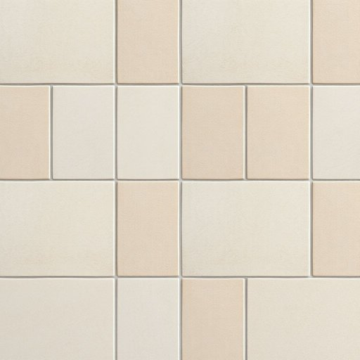

# grout

<h1 style="font-size: 2.5em; font-weight: 300; letter-spacing: 2px; margin: 0; color: #2c3e50;">
/graʊt/
</h1>

---

---

## 例句

Before we begin retiling the kitchen, the quality of the grout is crucial as it fills the gaps between tiles, prevents moisture penetration, and ultimately ensures the durability and hygiene of the floor.

*Before(/ˌbiˈfɔr/) we(/wi/) begin(/bɪˈgɪn/) retiling(/retiling*/) the(/ðə/) kitchen,(/ˈkɪʧən,/) the(/ðə/) quality(/kˈwɑləti/) of(/əv/) the(/ðə/) grout(/graʊt/) is(/ɪz/) crucial(/ˈkruʃəl/) as(/ɛz/) it(/ɪt/) fills(/fɪlz/) the(/ðə/) gaps(/gæps/) between(/bɪtˈwin/) tiles,(/taɪlz,/) prevents(/prɪˈvɛnts/) moisture(/ˈmɔɪsʧər/) penetration,(/ˌpɛnəˈtreɪʃən,/) and(/ənd/) ultimately(/ˈəltəmətli/) ensures(/ɪnˈʃʊrz/) the(/ðə/) durability(/dərəˈbɪlɪti/) and(/ənd/) hygiene(/ˈhaɪˌʤin/) of(/əv/) the(/ðə/) floor.(/flɔr./)*

**翻译：** 在开始重新铺设厨房瓷砖之前，填缝剂的质量至关重要，因为它不仅填补瓷砖间的缝隙，防止水分渗透，更保证了地面的耐用性和卫生状况。

---

## 解释

英语单词“grout”作为名词在家居生活用品的语境中，主要指用于填充瓷砖、石材或其他铺地材料之间缝隙的一种水泥状或浆状材料，常见于浴室、厨房的地面或墙面铺贴施工中。使用场合通常是在谈论装修、修缮或地面铺设时，提及“tile grout”（瓷砖填缝剂）等具体产品。英语学习者在使用“grout”时需注意它是不可数名词，通常不直接用复数形式，搭配时多用量词如“some grout”，表示一定量的填缝剂；常见搭配包括“apply grout”（涂抹填缝剂）、“clean the grout”（清理填缝剂）、“grout lines”（缝隙线）等。词源上，“grout”来自中古英语“grut”或“grout”，可能源于古法语“grouter”，意指搅拌或混合，最初含义即为混合物或粥状物，后专指这种建筑用浆料。中文语境中，“grout”准确的对应词为“瓷砖填缝剂”或简称“填缝剂”，指用于填补铺设材料缝隙以防止渗水和脏污的材料，不具褒贬含义，属于中性且专业的术语，在日常装修和维护对话中非常常见，体现了对细节美观和实用功能的重视。

---

<small style="color: #999; font-size: 0.9em;">2025-07-17 06:22:40</small>

