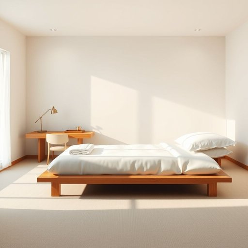

# guest-room

<h1 style="font-size: 2.5em; font-weight: 300; letter-spacing: 2px; margin: 0; color: #2c3e50;">
/guest-room*/
</h1>

---

---

## 例句

Whenever we have close friends visiting from out of town, we make sure the guest-room, which is decorated with calming colours and furnished with a comfortable double bed, fresh linens, and a small writing desk, is impeccably tidy and stocked with essentials like extra towels, a bedside lamp, and a selection of English breakfast teas to ensure they feel truly welcome and at home during their stay.

*Whenever(/wɛˈnɛvər/) we(/wi/) have(/hæv/) close(/kloʊz/) friends(/frɛndz/) visiting(/ˈvɪzɪtɪŋ/) from(/frəm/) out(/aʊt/) of(/əv/) town,(/taʊn,/) we(/wi/) make(/meɪk/) sure(/ʃʊr/) the(/ðə/) guest-room,(/guest-room*,/) which(/wɪʧ/) is(/ɪz/) decorated(/ˈdɛkərˌeɪtɪd/) with(/wɪθ/) calming(/ˈkɑmɪŋ/) colours(/colours*/) and(/ənd/) furnished(/ˈfərnɪʃt/) with(/wɪθ/) a(/ə/) comfortable(/ˈkəmfərtəbəl/) double(/ˈdəbəl/) bed,(/bɛd,/) fresh(/frɛʃ/) linens,(/ˈlɪnənz,/) and(/ənd/) a(/ə/) small(/smɔl/) writing(/ˈraɪtɪŋ/) desk,(/dɛsk,/) is(/ɪz/) impeccably(/ˌɪmˈpɛkəbli/) tidy(/ˈtaɪdi/) and(/ənd/) stocked(/stɑkt/) with(/wɪθ/) essentials(/ɛˈsɛnʃəlz/) like(/laɪk/) extra(/ˈɛkstrə/) towels,(/taʊəlz,/) a(/ə/) bedside(/ˈbɛdˌsaɪd/) lamp,(/læmp,/) and(/ənd/) a(/ə/) selection(/səˈlɛkʃən/) of(/əv/) English(/ˈɪŋlɪʃ/) breakfast(/ˈbrɛkfəst/) teas(/tiz/) to(/tɪ/) ensure(/ɪnˈʃʊr/) they(/ðeɪ/) feel(/fil/) truly(/ˈtruli/) welcome(/ˈwɛlkəm/) and(/ənd/) at(/æt/) home(/hoʊm/) during(/ˈdʊrɪŋ/) their(/ðɛr/) stay.(/steɪ./)*

**翻译：** 每当有亲密的朋友从外地来访，我们都会确保客房一尘不染。该房间以宁静的色调装饰，配备舒适的双人床、干净的床单和一张小写字台，备有额外的毛巾、床头灯和多款英式早餐茶等必需品，力求让客人在住宿期间感受到真正的欢迎与宾至如归。

---

## 解释

英语单词“guest-room”作为名词，指的是家中专门为来访客人准备的房间，通常配备床铺和基本生活设施，用于接待短期住宿的客人。具体使用场合多见于描述家庭住宅的布局、房屋介绍或旅游住宿业相关情境，如“guest-room in a house”（家庭中的客房）或“a hotel guest-room”（酒店客房）。英语学习者在使用“guest-room”时需注意其复合名词结构，通常书写为连字符连接的形式（guest-room），指具体的房间，而非单纯形容词加名词的组合；该词通常为可数名词，复数形式为“guest-rooms”。常见搭配如“spare guest-room”（空闲客房）、“set up a guest-room”（布置客房）等，表达时多强调此房间为临时使用，区别于家庭成员长期使用的卧室。该词源于“guest”（客人）和“room”（房间）的组合，源头清晰，符合英语构词习惯，无特殊隐喻或文化色彩，含义较为中性。中文语境中，“guest-room”准确翻译为“客房”或“客卧”，强调此房间专门供客人短期居住，与中文中的“卧室”或“寝室”相比，更侧重“接待客人”的功能。整体而言，“guest-room”是一个描述家庭居住空间中功能分区的实用名词，使用时需注意它的具体指代和书写规范，不带有褒贬意味，文化内涵平实，适用于家居生活用品和酒店住宿等多种场景。

---

<small style="color: #999; font-size: 0.9em;">2025-07-17 06:22:40</small>

