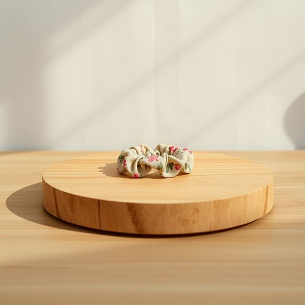

# hair-tie

<h1 style="font-size: 2.5em; font-weight: 300; letter-spacing: 2px; margin: 0; color: #2c3e50;">
/hair-tie*/
</h1>

---

---

## 例句

Could you please pass me a hair-tie from the drawer in the bedroom, the one with the floral pattern that’s usually tangled up with the other accessories, because I need to tie my hair back before we start cooking dinner?

*Could(/kʊd/) you(/ju/) please(/pliz/) pass(/pæs/) me(/mi/) a(/ə/) hair-tie(/hair-tie*/) from(/frəm/) the(/ðə/) drawer(/drɔr/) in(/ɪn/) the(/ðə/) bedroom,(/ˈbɛˌdrum,/) the(/ðə/) one(/wən/) with(/wɪθ/) the(/ðə/) floral(/ˈflɔrəl/) pattern(/ˈpætərn/) that’s(/that’s*/) usually(/ˈjuʒəwəli/) tangled(/ˈtæŋgəld/) up(/əp/) with(/wɪθ/) the(/ðə/) other(/ˈəðər/) accessories,(/ækˈsɛsəriz,/) because(/bɪˈkəz/) I(/aɪ/) need(/nid/) to(/tɪ/) tie(/taɪ/) my(/maɪ/) hair(/hɛr/) back(/bæk/) before(/ˌbiˈfɔr/) we(/wi/) start(/stɑrt/) cooking(/ˈkʊkɪŋ/) dinner?(/ˈdɪnər?/)*

**翻译：** 你能帮我从卧室的抽屉里拿一个发圈吗？就是那个带花纹、通常和其他配饰缠在一起的，因为我需要在开始做晚饭前把头发扎起来。

---

## 解释

英语单词“hair-tie”作为名词，在家居生活用品的场景中指用来绑头发的发圈、发绳或发带，通常是弹性材质以方便束起长发，保持头发整齐，避免遮挡眼睛或影响活动。具体使用场合多见于家庭、学校、健身、日常休闲甚至职场等需要将头发固定的时刻，语境中通常与整理头发、个人护理、女生日常用品等相关。在语法上，“hair-tie”作为可数名词，通常使用单数或复数形式，如“a hair-tie”或“some hair-ties”，且常与动词搭配使用，如“tie up your hair with a hair-tie”（用发圈绑起头发），“lose a hair-tie”（丢失发圈），“buy new hair-ties”（买新发圈），英语学习者应注意其不可与动词“tie”混淆，且“hair-tie”通常单独作为物品名词出现，少用于抽象含义。这个词的词源较为直白，源自于“hair”（头发）和“tie”（绑、系）的合成，直译即“绑头发的东西”，反映了其功能属性，最早可能用来指任何绑头发的装置，随着弹性发圈普及而专指此类弹性织物制品。在中文语境中，“hair-tie”准确的翻译为“发圈”或“发绳”，依据具体材质和形状也可称“发带”或“橡皮筋”（若指橡胶制），应避免直译为“绑头发的带子”，以免造成理解混淆。需要注意的是，“hair-tie”在日常生活用语中无特别褒贬含义或文化色彩，属于中性词汇，且多用于女性和儿童的个人护理用品，对男性则较少使用，但现代观念更为开放，也可适用不同性别的个人发饰整理。综上所述，“hair-tie”是指在日常生活中用于固定头发的发圈，是一个简单、功能明确、中性普通的家用小物品名词。

---

<small style="color: #999; font-size: 0.9em;">2025-07-17 06:22:40</small>

