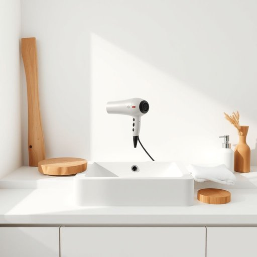

# hairdryer

<h1 style="font-size: 2.5em; font-weight: 300; letter-spacing: 2px; margin: 0; color: #2c3e50;">
/hairdryer*/
</h1>

---

---

## 例句

Before you rush out to meet everyone, make sure you grab the hairdryer from the bathroom, which, incidentally, has a built-in diffuser and multiple heat settings that are perfect not only for drying your hair quickly but also for adding volume and definition to curls.

*Before(/ˌbiˈfɔr/) you(/ju/) rush(/rəʃ/) out(/aʊt/) to(/tɪ/) meet(/mit/) everyone,(/ˈɛvriˌwən,/) make(/meɪk/) sure(/ʃʊr/) you(/ju/) grab(/græb/) the(/ðə/) hairdryer(/hairdryer*/) from(/frəm/) the(/ðə/) bathroom,(/ˈbæθˌrum,/) which,(/wɪʧ,/) incidentally,(/ˌɪnsɪˈdɛntəli,/) has(/həz/) a(/ə/) built-in(/ˈbɪlˌtɪn/) diffuser(/diffuser*/) and(/ənd/) multiple(/ˈməltəpəl/) heat(/hit/) settings(/ˈsɛtɪŋz/) that(/ðət/) are(/ər/) perfect(/ˈpərˌfɪkt/) not(/nɑt/) only(/ˈoʊnli/) for(/fər/) drying(/draɪɪŋ/) your(/jʊr/) hair(/hɛr/) quickly(/kˈwɪkli/) but(/bət/) also(/ˈɔlsoʊ/) for(/fər/) adding(/ˈædɪŋ/) volume(/ˈvɑljum/) and(/ənd/) definition(/ˌdɛfəˈnɪʃən/) to(/tɪ/) curls.(/kərlz./)*

**翻译：** 在你匆忙出门去见大家之前，别忘了从浴室带上吹风机。顺便一提，这款吹风机配备了内置扩散器和多档温度调节，不仅能快速吹干头发，还能为卷发增添饱满感和层次感。

---

## 解释

英语单词“hairdryer”作为名词，指的是一种用来吹干头发的电器，常见于家居生活用品中，通常出现在浴室或卧室等个人护理环境中。具体使用场合主要是洗发后快速吹干头发，或者造型时辅助定型，常见语境包括旅游时携带的便携设备、美容美发店的用具等。英语学习者在使用“hairdryer”时应注意，它是一个复合名词，由“hair”（头发）和“dryer”（干燥器）组成，作为可数名词时可用复数形式“hairdryers”，且一般不用于被动语态，只能搭配动词如“use”，“turn on”，“buy”等，常见固定搭配有“hairdryer settings”（吹风机档位）、“hairdryer heat”（吹风机热风）和“hairdryer cord”（吹风机电线）。词源方面，“hairdryer”起源于20世纪初，随电气技术普及后用于描述专为头发吹干设计的电热设备，反映了工业革命后生活电器的兴起。在中文语境中，“hairdryer”准确翻译为“吹风机”或“电吹风”，这是最日常且被广泛接受的表达，含义明确且无特殊褒贬或文化内涵，属于常见的家用电器词汇，语言色彩中性，适用于正式及非正式的语境。

---

<small style="color: #999; font-size: 0.9em;">2025-07-17 06:22:40</small>

