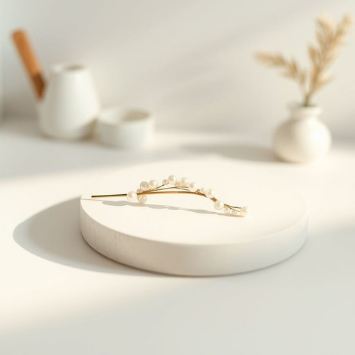

# hairpin

<h1 style="font-size: 2.5em; font-weight: 300; letter-spacing: 2px; margin: 0; color: #2c3e50;">
/hairpin*/
</h1>

---

---

## 例句

Could you please pass me a hairpin from the dressing table, the one with the little pearl decoration, because my fringe keeps falling into my eyes while I’m trying to cook in the kitchen?

*Could(/kʊd/) you(/ju/) please(/pliz/) pass(/pæs/) me(/mi/) a(/ə/) hairpin(/hairpin*/) from(/frəm/) the(/ðə/) dressing(/ˈdrɛsɪŋ/) table,(/ˈteɪbəl,/) the(/ðə/) one(/wən/) with(/wɪθ/) the(/ðə/) little(/ˈlɪtəl/) pearl(/pərl/) decoration,(/ˌdɛkərˈeɪʃən,/) because(/bɪˈkəz/) my(/maɪ/) fringe(/frɪnʤ/) keeps(/kips/) falling(/ˈfɑlɪŋ/) into(/ˈɪntu/) my(/maɪ/) eyes(/aɪz/) while(/waɪl/) I’m(/i’m*/) trying(/traɪɪŋ/) to(/tɪ/) cook(/kʊk/) in(/ɪn/) the(/ðə/) kitchen?(/ˈkɪʧən?/)*

**翻译：** 你能帮我从梳妆台上递一支发夹吗？就是那种带着小珍珠装饰的，因为我在厨房做饭时，刘海总是掉进眼睛里。

---

## 解释

单词“hairpin”作为名词在家居生活用品的英语语境中，通常指的是一种用于固定头发的小巧弯曲金属或塑料发夹，常见于整理发型或保持头发整齐，如在化妆、日常打理或户外活动中使用。英语学习者在使用“hairpin”时应注意其单数和复数形式“hairpins”的正确转换，以及它常与动词“use”（使用）、“insert”（插入）、“remove”（取下）等搭配，例如“use a hairpin to secure hair”（用发夹固定头发）。此外，它有时也用作形容词构成复合词（如“hairpin turn”指极其弯曲的发夹弯路，但此用法不属于家居用品范畴）。词源上，“hairpin”由“hair”（头发）和“pin”（针，别针）两部分组成，意指用来别头发的针状物，这一构词方式清晰反映了其功能和形状。中文环境中，“hairpin”应准确翻译为“发夹”或“发簪”，是一个中性词汇，无褒贬色彩，属于日常生活中常见的美容美发用品，文化上普遍认可且无特殊隐含意义。

---

<small style="color: #999; font-size: 0.9em;">2025-07-17 06:22:40</small>

