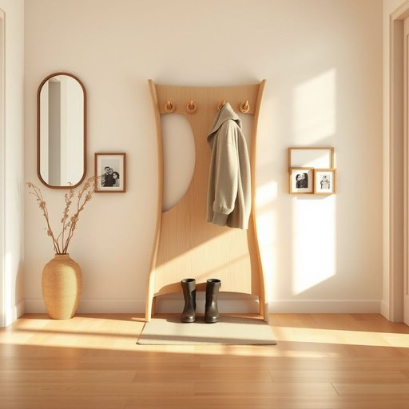

# hall

<h1 style="font-size: 2.5em; font-weight: 300; letter-spacing: 2px; margin: 0; color: #2c3e50;">
/hɔl/
</h1>

---

---

## 例句

After hanging her coat on the ornate wooden rack in the hall, which was adorned with vintage mirrors and framed family photos, she carefully placed the muddy boots on the mat to avoid dirtying the polished floorboards that gleamed under the soft, warm lighting.

*After(/ˈæftər/) hanging(/ˈhæŋɪŋ/) her(/hər/) coat(/koʊt/) on(/ɔn/) the(/ðə/) ornate(/ɔrˈneɪt/) wooden(/ˈwʊdən/) rack(/ræk/) in(/ɪn/) the(/ðə/) hall,(/hɔl,/) which(/wɪʧ/) was(/wɑz/) adorned(/əˈdɔrnd/) with(/wɪθ/) vintage(/ˈvɪntɪʤ/) mirrors(/ˈmɪrərz/) and(/ənd/) framed(/freɪmd/) family(/ˈfæməli/) photos,(/ˈfoʊˌtoʊz,/) she(/ʃi/) carefully(/ˈkɛrfəli/) placed(/pleɪst/) the(/ðə/) muddy(/ˈmədi/) boots(/buts/) on(/ɔn/) the(/ðə/) mat(/mæt/) to(/tɪ/) avoid(/əˈvɔɪd/) dirtying(/dirtying*/) the(/ðə/) polished(/ˈpɑlɪʃt/) floorboards(/ˈflɔrˌbɔrdz/) that(/ðət/) gleamed(/glimd/) under(/ˈəndər/) the(/ðə/) soft,(/sɔft,/) warm(/wɔrm/) lighting.(/ˈlaɪtɪŋ./)*

**翻译：** 她将大衣挂在玄关那座装饰华丽的木质衣架上，衣架上点缀着复古镜子和装裱精美的全家福照片，随后她小心翼翼地将泥泞的靴子放在门垫上，以免弄脏在柔和温暖灯光下闪耀光泽的打磨木地板。

---

## 解释

单词“hall”作为名词在家居生活用品的语境中，通常指房屋入口处的过道或门厅，是连接住宅外部与内部各功能区的空间，例如门厅、玄关或走廊，常用于描述家中接待访客或存放外套、鞋子的区域。英语学习者需要注意，“hall”一般是可数名词，其复数形式为“halls”，且常与介词“in”或“at”搭配使用，如“in the hall”（在门厅）或“at the hall”（在门厅处）；此外，常见表达还包括“hallway”（走廊）或“entrance hall”（入口大厅），但“hall”偏向入口或宽敞的公共区域，而非狭窄通道。词源上，“hall”源自古英语“heall”，意指大型的居所或大厅，最初用于描述领主或贵族住所中的主要会客厅，后来逐渐引申为较为一般的入口空间。翻译成中文时，“hall”在家居生活中一般理解为“门厅”或“玄关”，在某些情况下也可指“大厅”或“过道”，需结合具体语境判断。该词本身无明显褒贬含义，属于中性词汇，但在文化层面，英国传统住宅中的“hall”往往象征着家庭的门面和待客的重要性，因此在文学或生活场景中有所侧重。学习时应注意区别“hall”与“room”（房间）、“lobby”（大堂）等词的细微差别。

---

<small style="color: #999; font-size: 0.9em;">2025-07-17 06:22:40</small>

