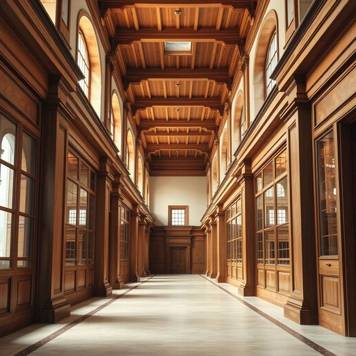

# hallway

<h1 style="font-size: 2.5em; font-weight: 300; letter-spacing: 2px; margin: 0; color: #2c3e50;">
/ˈhɔlˌweɪ/
</h1>

---

---

## 例句

As the museum curator explained, the hallway’s intricate design and historical significance greatly enhanced visitors’ appreciation of the art collection displayed within.

*As(/ɛz/) the(/ðə/) museum(/mˈjuziəm/) curator(/ˈkjʊrətər/) explained,(/ɪkˈspleɪnd,/) the(/ðə/) hallway’s(/hallway’s*/) intricate(/ˈɪntrəkət/) design(/dɪˈzaɪn/) and(/ənd/) historical(/hɪˈstɔrɪkəl/) significance(/sɪgˈnɪfɪkəns/) greatly(/ˈgreɪtli/) enhanced(/ɛnˈhænst/) visitors’(/visitors’*’/) appreciation(/əˌpriʃiˈeɪʃən/) of(/əv/) the(/ðə/) art(/ɑrt/) collection(/kəˈlɛkʃən/) displayed(/dɪˈspleɪd/) within.(/wɪˈθɪn./)*

**翻译：** 正如博物馆策展人所解释的那样，走廊复杂精致的设计和深厚的历史意义极大地提升了参观者对馆内艺术珍品的欣赏度。

---

## 解释

英语单词“hallway”作为名词，通常指建筑物内部连接各个房间的走廊或过道，尤其是在住宅中常见，用于从入口通往房间或其他区域的通道；例如，人们会说“Please leave your shoes in the hallway”（请把鞋放在走廊里）。在家居生活用品场景中，“hallway”用于描述家中的一部分空间，强调通行和连接功能。英语学习者使用该词时应注意其为可数名词，通常用单数或复数形式“hallways”表示多个走廊，且常与动词如“walk down,” “decorate,” “paint”搭配，形容词如“narrow,” “long,” “dimly lit”也常用于描述走廊特征。此外，“hallway”一般不用于室外，而是室内空间的专有名词，其构词形式多为复合词，拼写需注意一词连写。该词源自古英语“hall”（大厅）加后缀“way”（路、道），合起来意指通向大厅或大房间的道路，反映古代建筑结构中连接主厅与其它房间的走道。中文语境中，“hallway”通常准确译为“走廊”或“过道”，突出其连接和通行的功能，不宜译为“大厅”或“门厅”，后者对应的英文是“hall”或“foyer”。在文化色彩上，“hallway”本身较为中性，无褒贬意义，但在家居设计中，明亮宽敞的hallway往往被视为住所舒适的重要因素。

---

<small style="color: #999; font-size: 0.9em;">2025-07-17 06:22:40</small>

