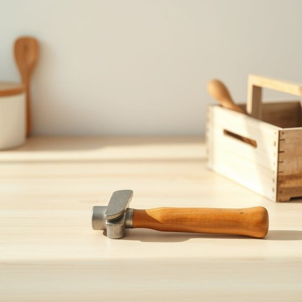

# hammer

<h1 style="font-size: 2.5em; font-weight: 300; letter-spacing: 2px; margin: 0; color: #2c3e50;">
/ˈhæmər/
</h1>

---

---

## 例句

Could you please pass me the hammer that’s lying next to the toolbox on the kitchen counter, the one with the wooden handle and slightly chipped head, because I need it to carefully hang up the new shelves we bought last weekend?

*Could(/kʊd/) you(/ju/) please(/pliz/) pass(/pæs/) me(/mi/) the(/ðə/) hammer(/ˈhæmər/) that’s(/that’s*/) lying(/laɪɪŋ/) next(/nɛkst/) to(/tɪ/) the(/ðə/) toolbox(/ˈtulˌbɔks/) on(/ɔn/) the(/ðə/) kitchen(/ˈkɪʧən/) counter,(/ˈkaʊntər,/) the(/ðə/) one(/wən/) with(/wɪθ/) the(/ðə/) wooden(/ˈwʊdən/) handle(/ˈhændəl/) and(/ənd/) slightly(/sˈlaɪtli/) chipped(/ʧɪpt/) head,(/hɛd,/) because(/bɪˈkəz/) I(/aɪ/) need(/nid/) it(/ɪt/) to(/tɪ/) carefully(/ˈkɛrfəli/) hang(/hæŋ/) up(/əp/) the(/ðə/) new(/nu/) shelves(/ʃɛlvz/) we(/wi/) bought(/bɔt/) last(/læst/) weekend?(/ˈwiˌkɪnd?/)*

**翻译：** 请您把厨房台面上工具箱旁边那把带木柄、锤头略有缺口的锤子递给我，好让我小心地挂上我们上周末买的新架子。

---

## 解释

英语单词“hammer”作为家居生活用品中的名词，指的是一种用来敲打物体的工具，通常由木柄和铁质或钢质的头部组成，广泛用于钉钉子、拆卸或组装家具等场合。英语学习者在使用“hammer”时应注意它是可数名词，常见搭配有“a hammer”，“the hammer”，“use a hammer”，“a claw hammer”（指带有钩爪的锤子，便于拔钉子）等表达，此外还常与动词“hit”，“strike”，“hammer down”等搭配，形象地描述敲打动作。从语法角度看，作为名词，“hammer”可以作主语、宾语，也常出现在短语中如“hammer nail into the wall”（用锤子把钉子钉进墙里），使用时需要根据上下文选择适当的冠词和动词形式。词源上，“hammer”来源于古英语“hamor”，与其他日耳曼语族语言中表示锤子的词汇相对应，具有悠久的历史，反映了工具名称的基本稳定性和功能性。在中文语境中，“hammer”准确翻译为“锤子”，强调其作为敲击工具的本质，通常无特殊褒贬含义，属于实用工具词汇，不含特殊文化色彩，但在比喻用法中，如“hammer out an agreement”（达成协议），则体现了“锤炼、反复敲打”隐喻努力和坚持的含义，英语学习者应根据语境区别。整体来看，“hammer”在家居生活用品中的含义具体、实用，表达明确，适合初学者理解和使用。

---

<small style="color: #999; font-size: 0.9em;">2025-07-17 06:22:40</small>

