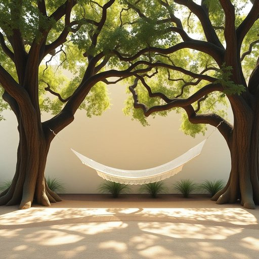

# hammock

<h1 style="font-size: 2.5em; font-weight: 300; letter-spacing: 2px; margin: 0; color: #2c3e50;">
/ˈhæmək/
</h1>

---

---

## 例句

After a long day of tidying up the garden and assembling the new furniture, I finally managed to hang the hammock between the two old oak trees, where its soft, woven fabric gently sways in the breeze, creating the perfect spot to relax with a book or simply enjoy the peaceful sounds of the neighbourhood.

*After(/ˈæftər/) a(/ə/) long(/lɔŋ/) day(/deɪ/) of(/əv/) tidying(/tidying*/) up(/əp/) the(/ðə/) garden(/ˈgɑrdən/) and(/ənd/) assembling(/əˈsɛmbəlɪŋ/) the(/ðə/) new(/nu/) furniture,(/ˈfərnɪʧər,/) I(/aɪ/) finally(/ˈfaɪnəli/) managed(/ˈmænɪʤd/) to(/tɪ/) hang(/hæŋ/) the(/ðə/) hammock(/ˈhæmək/) between(/bɪtˈwin/) the(/ðə/) two(/tu/) old(/oʊld/) oak(/oʊk/) trees,(/triz,/) where(/wɛr/) its(/ɪts/) soft,(/sɔft,/) woven(/ˈwoʊvən/) fabric(/ˈfæbrɪk/) gently(/ˈʤɛntli/) sways(/sweɪz/) in(/ɪn/) the(/ðə/) breeze,(/briz,/) creating(/kriˈeɪtɪŋ/) the(/ðə/) perfect(/ˈpərˌfɪkt/) spot(/spɑt/) to(/tɪ/) relax(/rɪˈlæks/) with(/wɪθ/) a(/ə/) book(/bʊk/) or(/ər/) simply(/ˈsɪmpli/) enjoy(/ˌɛnˈʤɔɪ/) the(/ðə/) peaceful(/ˈpisfəl/) sounds(/saʊnz/) of(/əv/) the(/ðə/) neighbourhood.(/ˈneɪbərˌhʊd./)*

**翻译：** 经过一天辛劳地整理花园和组装新家具后，我终于成功地将吊床挂在两棵古老的橡树之间，那柔软编织的布料在微风中轻轻摇曳，营造出一个理想的角落，既能静心读书，也能悠然聆听宁静的邻里之声。

---

## 解释

"hammock"作为名词，指的是一种悬挂式的床或吊床，通常由布料、绳索或网状材料制成，适合在两点之间悬挂，供人躺卧休息。在家居生活用品的语境中，hammock常见于户外环境如阳台、花园、露营地等，适合休闲放松使用。英语学习者在使用"hammock"时需注意其不可数或可数用法，通常应使用复数形式"hammocks"表示多张吊床；在句中可用作主语或宾语，如"The hammock is hanging between two trees"。常见搭配包括"hang a hammock"（悬挂吊床）、"lie in a hammock"（躺在吊床上）、"hammock stand"（吊床架）等。作为名词，hammock没有复杂的语法变化，通常与介词"in"搭配表示身处吊床中。词源方面，hammock源自西班牙语"hámaca"，进而来自加勒比地区土著语言，将其引入英语是通过欧洲殖民者对当地生活方式的认识和借用。中文语境中，hammock通常准确译为“吊床”，强调其悬挂结构和休息功能；这一词汇一般无特殊褒贬色彩，属于中性休闲用品的范畴，带有悠闲、轻松的文化印象，适合于户外或休闲空间使用。因此，理解hammock不仅需掌握其物理形式和功能，还应注意其文化背景和实际使用环境，避免与普通床铺混淆。

---

<small style="color: #999; font-size: 0.9em;">2025-07-17 06:22:40</small>

