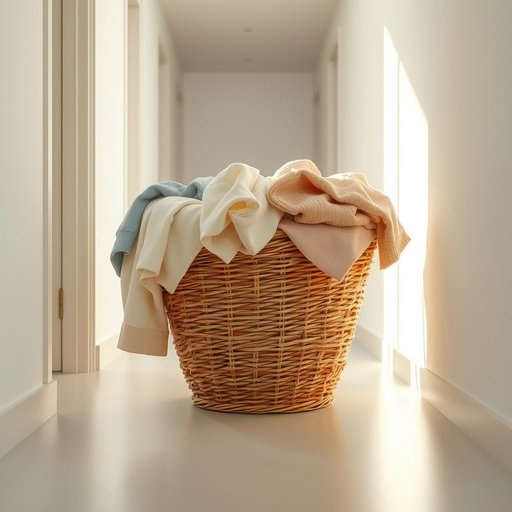

# hamper

<h1 style="font-size: 2.5em; font-weight: 300; letter-spacing: 2px; margin: 0; color: #2c3e50;">
/ˈhæmpər/
</h1>

---

---

## 例句

Could you please empty the laundry hamper in the hallway before our guests arrive, as it's overflowing with clothes that would make the room look untidy and cluttered despite the otherwise impeccable tidiness you've maintained throughout the weekend?

*Could(/kʊd/) you(/ju/) please(/pliz/) empty(/ˈɛmti/) the(/ðə/) laundry(/ˈlɔndri/) hamper(/ˈhæmpər/) in(/ɪn/) the(/ðə/) hallway(/ˈhɔlˌweɪ/) before(/ˌbiˈfɔr/) our(/ɑr/) guests(/gɛsts/) arrive,(/əraɪv,/) as(/ɛz/) it's(/ɪts/) overflowing(/ˈoʊvərˌfloʊɪŋ/) with(/wɪθ/) clothes(/kloʊðz/) that(/ðət/) would(/wʊd/) make(/meɪk/) the(/ðə/) room(/rum/) look(/lʊk/) untidy(/ənˈtaɪdi/) and(/ənd/) cluttered(/ˈklətərd/) despite(/dɪˈspaɪt/) the(/ðə/) otherwise(/ˈəðərˌwaɪz/) impeccable(/ˌɪmˈpɛkəbəl/) tidiness(/tidiness*/) you've(/juv/) maintained(/meɪnˈteɪnd/) throughout(/θruaʊt/) the(/ðə/) weekend?(/ˈwiˌkɪnd?/)*

**翻译：** 请在客人到来之前清空走廊里的脏衣篮，因为里面堆满了衣物。虽然你整个周末都保持得井井有条，但这些衣物仍然会让房间显得凌乱不堪。

---

## 解释

“hamper”作为名词在家居生活用品的英语语境中，通常指用于收纳脏衣服的洗衣篮或洗衣筐，常见于家庭日常生活中，尤其是在整理衣物、储存待洗衣物的场合。英语学习者使用该词作为名词时需注意，其可数形式为“hampers”，且通常与形容词连用，如“laundry hamper”（洗衣篮）、“woven hamper”（编织篮）等，具有明确的物理容器含义，不宜与动词“hamper”（阻碍）混淆。语法上，“hamper”作为名词时通常用作单纯名词，不带动词属性，常搭配表示容器的形容词、防水材质、大小描述词以及动词“fill”、“empty”等，表达清空或装满的动作。在表达技巧上，描述“hamper”的材质、容量、用途时可具体而生动，提高语言表现力。词源方面，“hamper”起源于中古英语，最初指一个装食物的篮子或盒子，来源可能与古法语“hanaper”有关，原指装有酒杯的容器，逐渐引申为装载物品的容器。文化上，“hamper”作为家居用品，体现了井然有序、生活整洁的理念，没有特别褒贬色彩，但在不同区域和家庭中所用材质和形态有所不同。在中文语境中，“hamper”精准翻译为“洗衣篮”或“洗衣筐”，意指家庭中用于收纳脏衣服的容器，强调其实用性和日常性，理解时需避免与其他含义的混淆，确保仅指具体的生活用品容器，帮助语言学习者在描述家居环境时准确表达。

---

<small style="color: #999; font-size: 0.9em;">2025-07-17 06:22:40</small>

