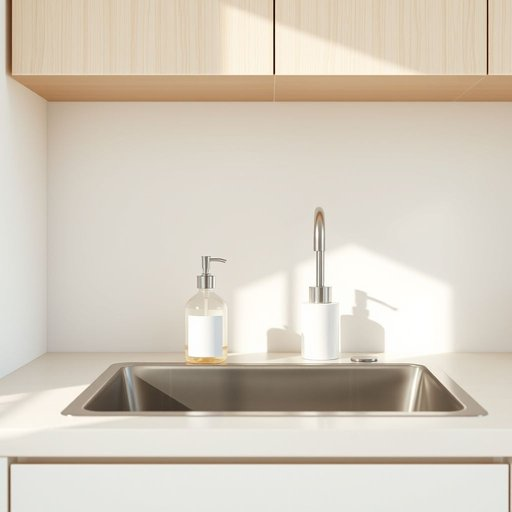

# hand-soap

<h1 style="font-size: 2.5em; font-weight: 300; letter-spacing: 2px; margin: 0; color: #2c3e50;">
/hand-soap*/
</h1>

---

---

## 例句

Could you please check under the sink for the hand-soap bottle that has the lavender scent, as I want to refill the dispenser in the kitchen before our guests arrive this evening, ensuring everything is perfectly tidy and welcoming?

*Could(/kʊd/) you(/ju/) please(/pliz/) check(/ʧɛk/) under(/ˈəndər/) the(/ðə/) sink(/sɪŋk/) for(/fər/) the(/ðə/) hand-soap(/hand-soap*/) bottle(/ˈbɑtəl/) that(/ðət/) has(/həz/) the(/ðə/) lavender(/ˈlævəndər/) scent,(/sɛnt,/) as(/ɛz/) I(/aɪ/) want(/wɔnt/) to(/tɪ/) refill(/ˈrifɪl/) the(/ðə/) dispenser(/dɪˈspɛnsər/) in(/ɪn/) the(/ðə/) kitchen(/ˈkɪʧən/) before(/ˌbiˈfɔr/) our(/ɑr/) guests(/gɛsts/) arrive(/əraɪv/) this(/ðɪs/) evening,(/ˈivnɪŋ,/) ensuring(/ɪnˈʃʊrɪŋ/) everything(/ˈɛvriˌθɪŋ/) is(/ɪz/) perfectly(/ˈpərfəktli/) tidy(/ˈtaɪdi/) and(/ənd/) welcoming?(/ˈwɛlkəmɪŋ?/)*

**翻译：** 请您帮忙在水槽下方查找那瓶薰衣草香型的洗手液，我想在今晚客人到来之前给厨房的按压器补充洗手液，确保一切整洁有序，宾至如归。

---

## 解释

英语单词"hand-soap"作为名词，指专门用于洗手的肥皂，通常用于家居生活中保持手部清洁的日常用品，这类肥皂可能是固体皂块，也可能是液体洗手液，常见于洗手间或厨房等需要洗手的场所，在具体使用场合上，"hand-soap"多用于家庭环境、公共卫生场所或商业空间，强调其用途专门针对手部清洁而非身体其他部位，英语学习者在使用“hand-soap”时应注意，这个词通常作为复合名词出现，中间以连字符连接，表示“用于手的肥皂”，语法上用作单数或复数形式（hand-soaps），搭配时常见与形容词连用，如“liquid hand-soap”（液体洗手液），“antibacterial hand-soap”（抗菌洗手皂），也可与动词连用如“wash with hand-soap”（用洗手皂洗手），此外，“handsoap”作为一个复合词也存在，但“hand-soap”更为规范和常用，词源上，“hand-soap”由“hand”（手）和“soap”（肥皂）组成，直接表达了该肥皂的使用部位和功能，属于典型的合成词，没有特别的历史文化隐含义，在中文语境中，“hand-soap”准确翻译为“洗手皂”或“洗手液”，强调其专用性和用途，区别于普通肥皂或沐浴皂，该词本身无褒贬色彩，属于中性词汇，反映现代人注重手部卫生习惯和健康意识的生活细节，常见于卫生健康教育和生活用品分类中。

---

<small style="color: #999; font-size: 0.9em;">2025-07-17 06:22:40</small>

