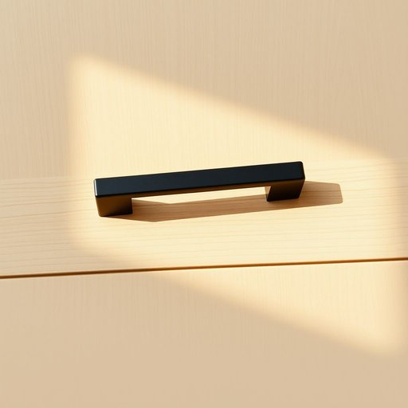

# handle

<h1 style="font-size: 2.5em; font-weight: 300; letter-spacing: 2px; margin: 0; color: #2c3e50;">
/ˈhændəl/
</h1>

---

---

## 例句

Could you please tighten the handle on the kitchen cupboard, which has been coming loose for weeks and is now preventing the door from closing properly, as it’s starting to annoy everyone who uses that space daily?

*Could(/kʊd/) you(/ju/) please(/pliz/) tighten(/ˈtaɪtən/) the(/ðə/) handle(/ˈhændəl/) on(/ɔn/) the(/ðə/) kitchen(/ˈkɪʧən/) cupboard,(/ˈkəbərd,/) which(/wɪʧ/) has(/həz/) been(/bɪn/) coming(/ˈkəmɪŋ/) loose(/lus/) for(/fər/) weeks(/wiks/) and(/ənd/) is(/ɪz/) now(/naʊ/) preventing(/prɪˈvɛnɪŋ/) the(/ðə/) door(/dɔr/) from(/frəm/) closing(/ˈkloʊzɪŋ/) properly,(/ˈprɑpərli,/) as(/ɛz/) it’s(/it’s*/) starting(/ˈstɑrtɪŋ/) to(/tɪ/) annoy(/əˈnɔɪ/) everyone(/ˈɛvriˌwən/) who(/hu/) uses(/ˈjuzɪz/) that(/ðət/) space(/speɪs/) daily?(/ˈdeɪli?/)*

**翻译：** 请您将厨房橱柜上的把手拧紧，它已经松动了好几周，现在导致柜门无法正常关闭，使用这一区域的每个人都开始感到很困扰。

---

## 解释

英语单词“handle”作为名词在家居生活用品场景中，通常指物体上供手握、拉动或操作的部分，如门把手、抽屉拉手、水壶把手等，使用时多见于具体描述家具或用具的构造和功能。在具体语境中，例如“the door handle”（门把手）、“a drawer handle”（抽屉拉手）或“a suitcase handle”（行李箱把手），均指便于手握以便使用的部分。英语学习者需要注意“handle”作为名词时是可数名词，常见搭配有“door handle”“cabinet handle”“handle design”等，且通常位于修饰名词前作定语使用。此外，复数形式为“handles”，表达多个把手或同类部件，作为物理实体时多数不带冠词，除非特指某一个。词源方面，“handle”源自古英语“handle”（手柄），最初指手能够抓握的部分，突出其作为“手的延伸”功能，这一点与其现代含义直接相关，也反映了物体设计是为了便于人手操作。在中文语境中，“handle”准确译为“把手”“手柄”或“拉手”，这是最贴切的对应词，既表达了该部分具备的功能性，也符合家居用品的常用称谓。该词本身无贬义或褒义，属于中性词汇，具体色彩和态度多由上下文决定；需注意不要混淆其作为动词“处理，应对”的含义。综上，理解和使用“handle”作为名词时，应结合具体家居物品语境，掌握其物理性质和数量信息，同时牢记其核心是便于手握的部件，使表达清晰准确。

---

<small style="color: #999; font-size: 0.9em;">2025-07-17 06:22:40</small>

