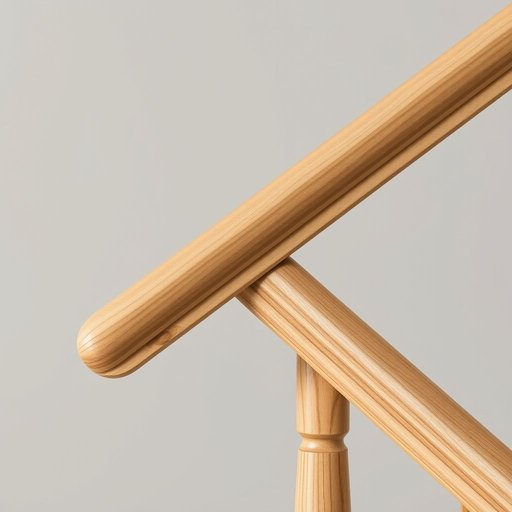

# handrail

<h1 style="font-size: 2.5em; font-weight: 300; letter-spacing: 2px; margin: 0; color: #2c3e50;">
/ˈhænˌdreɪl/
</h1>

---

---

## 例句

When renovating the staircase, the intricate craftsmanship of the handrail became a focal point, showcasing not only its functional role in providing support and safety but also its transformation into an artistic element that elevates the entire hallway’s design.

*When(/wɪn/) renovating(/ˈrɛnəˌveɪtɪŋ/) the(/ðə/) staircase,(/ˈstɛrˌkeɪs,/) the(/ðə/) intricate(/ˈɪntrəkət/) craftsmanship(/ˈkræftsmənˌʃɪp/) of(/əv/) the(/ðə/) handrail(/ˈhænˌdreɪl/) became(/bɪˈkeɪm/) a(/ə/) focal(/ˈfoʊkəl/) point,(/pɔɪnt,/) showcasing(/ˈʃoʊkeɪsɪŋ/) not(/nɑt/) only(/ˈoʊnli/) its(/ɪts/) functional(/ˈfəŋkʃənəl/) role(/roʊl/) in(/ɪn/) providing(/prəˈvaɪdɪŋ/) support(/səˈpɔrt/) and(/ənd/) safety(/ˈseɪfti/) but(/bət/) also(/ˈɔlsoʊ/) its(/ɪts/) transformation(/ˌtrænsfərˈmeɪʃən/) into(/ˈɪntu/) an(/ən/) artistic(/ɑrˈtɪstɪk/) element(/ˈɛləmənt/) that(/ðət/) elevates(/ˈɛləˌveɪts/) the(/ðə/) entire(/ɪnˈtaɪər/) hallway’s(/hallway’s*/) design.(/dɪˈzaɪn./)*

**翻译：** 在楼梯翻新过程中，扶手精致的工艺成为了焦点，不仅展示了其提供支撑和安全的功能作用，更体现了其作为艺术元素的转变，提升了整个走廊的设计格调。

---

## 解释

英语单词handrail作为名词，在家居生活用品的语境中指的是安装在楼梯、走廊或平台边缘供人扶持的扶手，主要用于保障安全和辅助行走，常见于楼梯旁、阳台或走道旁边。使用场合通常涉及楼梯上下或需要额外支持的环境，例如老年人或行动不便者特别依赖handrail来维持平衡。英语学习者在使用handrail时要注意，它是可数名词，通常以单数或复数形式出现（如a handrail, handrails）；常见搭配有grab the handrail（抓住扶手）、hold onto the handrail（紧握扶手）、install a handrail（安装扶手），表达时常用介词短语如along the handrail或next to the handrail。词源上，handrail由hand（手）和rail（扶手、栏杆）组成，字面意义即供手握持的栏杆，源自英语中对辅助结构的直白命名，反映其实用功能，没有特殊的修辞或隐喻色彩。在中文语境中，handrail准确翻译为扶手，强调的是可供手握持的支撑物，既可以是木质、金属或塑料材质，多用于楼梯或走廊边，有时也称为栏杆但扶手更贴切其辅助性特征。该词在日常生活中属于中性词，无褒贬或特殊文化内涵，仅指代实际存在的家居设施，表达明确且通用，是家居安全设计中的常用术语。

---

<small style="color: #999; font-size: 0.9em;">2025-07-17 06:22:40</small>

