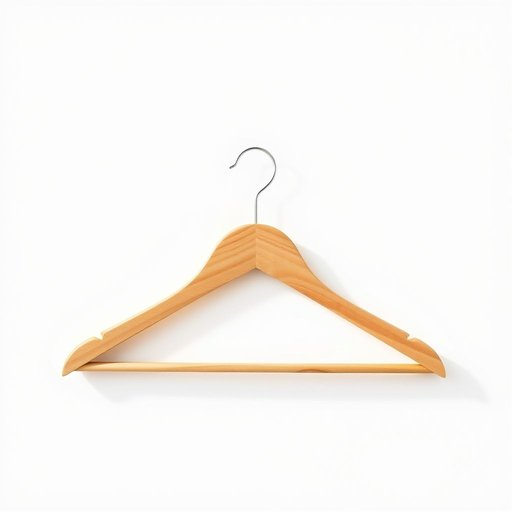

# hanger

<h1 style="font-size: 2.5em; font-weight: 300; letter-spacing: 2px; margin: 0; color: #2c3e50;">
/ˈhæŋər/
</h1>

---

---

## 例句

The intricate design of the chandelier, a magnificent example of craftsmanship, illuminated the grand ballroom with a dazzling array of crystals that captured the attention of every guest, making it the centerpiece of the evening’s elegant gala.

*The(/ðə/) intricate(/ˈɪntrəkət/) design(/dɪˈzaɪn/) of(/əv/) the(/ðə/) chandelier,(/ʃændəˈlɪr,/) a(/ə/) magnificent(/mægˈnɪfɪsənt/) example(/ɪgˈzæmpəl/) of(/əv/) craftsmanship,(/ˈkræftsmənˌʃɪp,/) illuminated(/ˌɪˈluməˌneɪtəd/) the(/ðə/) grand(/grænd/) ballroom(/ˈbɔˌlrum/) with(/wɪθ/) a(/ə/) dazzling(/ˈdæzəlɪŋ/) array(/əreɪ/) of(/əv/) crystals(/ˈkrɪstəlz/) that(/ðət/) captured(/ˈkæpʧərd/) the(/ðə/) attention(/əˈtɛnʃən/) of(/əv/) every(/ˈɛvəri/) guest,(/gɛst,/) making(/ˈmeɪkɪŋ/) it(/ɪt/) the(/ðə/) centerpiece(/ˈsɛntərˌpis/) of(/əv/) the(/ðə/) evening’s(/evening’s*/) elegant(/ˈɛləgənt/) gala.(/ˈgælə./)*

**翻译：** 吊灯精致的设计堪称工艺的杰作，以璀璨夺目的水晶辉映着宽敞华丽的舞厅，吸引了每一位宾客的目光，成为当晚优雅盛会的焦点。

---

## 解释

英语单词“hanger”作为名词在家居生活用品的语境中，主要指用来悬挂衣物的“衣架”，通常由金属、塑料或木头制成，用于挂衬衫、外套等衣服，放置于衣柜或衣架杆上。具体使用场合多见于描述整理衣物、储存空间或购物时提及配件，如“put your coat on the hanger”（把外套挂在衣架上）。英语学习者在使用“hanger”时应注意其可数名词性质，通常需加冠词（a hanger/the hangers）并与表示衣物的动词搭配，如“hang on a hanger”（挂在衣架上），而不能错用为挂“物品”或“动作”本身。此外，“hanger”还可作比喻用法指“悬挂物”，但在家居语境中主要限于衣架。词源方面，“hanger”来源于动词“hang”的派生名词，最初意为“悬挂者”或“悬挂物”，逐渐专指用于悬挂衣服的工具。在中文语境中，“hanger”准确翻译为“衣架”，理解时强调其实用功能和形态特征，避免误解为其他带挂钩性质的器具。该词无明显褒贬色彩，属于日常生活中的中性词汇，文化内涵相对简单，主要体现衣物收纳整理的生活细节。

---

<small style="color: #999; font-size: 0.9em;">2025-07-17 06:22:40</small>

