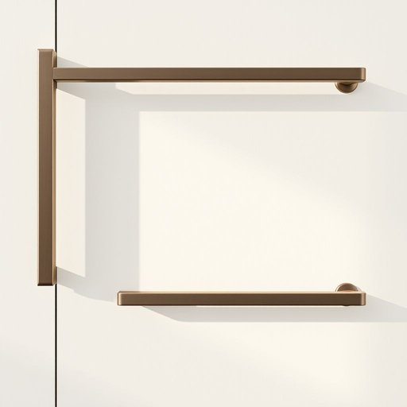

# hardware

<h1 style="font-size: 2.5em; font-weight: 300; letter-spacing: 2px; margin: 0; color: #2c3e50;">
/ˈhɑrdˌwɛr/
</h1>

---

---

## 例句

Before starting the kitchen renovation, it is essential to ensure that the cabinet handles, as crucial hardware components, not only complement the overall design aesthetic but also possess the durability required to endure daily use, otherwise premature wear and tear could lead to significant issues.

*Before(/ˌbiˈfɔr/) starting(/ˈstɑrtɪŋ/) the(/ðə/) kitchen(/ˈkɪʧən/) renovation,(/ˌrɛnəˈveɪʃən,/) it(/ɪt/) is(/ɪz/) essential(/ɛˈsɛnʃəl/) to(/tɪ/) ensure(/ɪnˈʃʊr/) that(/ðət/) the(/ðə/) cabinet(/ˈkæbənət/) handles,(/ˈhændəlz,/) as(/ɛz/) crucial(/ˈkruʃəl/) hardware(/ˈhɑrdˌwɛr/) components,(/kəmˈpoʊnənts,/) not(/nɑt/) only(/ˈoʊnli/) complement(/ˈkɑmpləmənt/) the(/ðə/) overall(/ˈoʊvərˌɔl/) design(/dɪˈzaɪn/) aesthetic(/ɛsˈθɛtɪk/) but(/bət/) also(/ˈɔlsoʊ/) possess(/pəˈzɛs/) the(/ðə/) durability(/dərəˈbɪlɪti/) required(/rikˈwaɪərd/) to(/tɪ/) endure(/ɪnˈdʊr/) daily(/ˈdeɪli/) use,(/juz,/) otherwise(/ˈəðərˌwaɪz/) premature(/ˌpriməˈʧʊr/) wear(/wɛr/) and(/ənd/) tear(/tɪr/) could(/kʊd/) lead(/lɛd/) to(/tɪ/) significant(/sɪgˈnɪfɪkənt/) issues.(/ˈɪʃuz./)*

**翻译：** 在开始厨房改造之前，务必确保橱柜拉手作为关键的五金配件，不仅与整体设计风格相协调，还具备足以承受日常使用的耐用性，否则过早的磨损可能引发严重问题。

---

## 解释

英语单词hardware作为名词在家居生活用品的语境中主要指与房屋装修和家具安装相关的五金制品如门把手铰链锁具螺丝钉及各种金属固定件等常见于描述装修材料家具配件或维修工具时使用使用时常见短语有door hardware（门五金）cabinet hardware（橱柜五金）或household hardware（家用五金）学习者应注意hardware作为不可数名词时通常不加复数形式且其涵盖的范围较广包括实物五金件而非电子设备尽管在计算机领域hardware指电脑硬件词源方面hardware源自中古英语结合了hard（坚固的）和ware（器物）强调其实用且坚硬的金属材料特性在中文语境中hardware对应的准确翻译应为五金或五金制品意味着用于家具门窗的金属配件避免与硬件（计算机设备）混淆该词在家居用品领域无褒贬色彩是中性词主要体现功能性和实用性了解其具体指代的产品类别对准确理解和使用尤为重要

---

<small style="color: #999; font-size: 0.9em;">2025-07-17 06:22:40</small>

