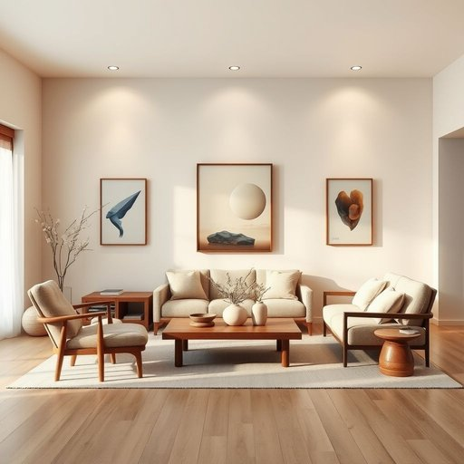

# harmony

<h1 style="font-size: 2.5em; font-weight: 300; letter-spacing: 2px; margin: 0; color: #2c3e50;">
/ˈhɑrməni/
</h1>

---

---

## 例句

Although the living room was filled with an eclectic mix of vintage furniture and modern art pieces, the subtle coordination of colours and textures created a sense of harmony that made the entire space feel warm, inviting, and perfectly balanced.

*Although(/ˌɔlˈðoʊ/) the(/ðə/) living(/ˈlɪvɪŋ/) room(/rum/) was(/wɑz/) filled(/fɪld/) with(/wɪθ/) an(/ən/) eclectic(/ɪˈklɛktɪk/) mix(/mɪks/) of(/əv/) vintage(/ˈvɪntɪʤ/) furniture(/ˈfərnɪʧər/) and(/ənd/) modern(/ˈmɑdərn/) art(/ɑrt/) pieces,(/ˈpisɪz,/) the(/ðə/) subtle(/ˈsətəl/) coordination(/koʊˌɔrdəˈneɪʃən/) of(/əv/) colours(/colours*/) and(/ənd/) textures(/ˈtɛksʧərz/) created(/kriˈeɪtɪd/) a(/ə/) sense(/sɛns/) of(/əv/) harmony(/ˈhɑrməni/) that(/ðət/) made(/meɪd/) the(/ðə/) entire(/ɪnˈtaɪər/) space(/speɪs/) feel(/fil/) warm,(/wɔrm,/) inviting,(/ˌɪnˈvaɪtɪŋ,/) and(/ənd/) perfectly(/ˈpərfəktli/) balanced.(/ˈbælənst./)*

**翻译：** 尽管客厅陈设了风格迥异的复古家具与现代艺术品，但色彩与质感的巧妙协调营造出一种和谐感，使整个空间既温馨宜人，又完美平衡。

---

## 解释

在家居生活用品的语境中，英语单词harmony作为名词主要指不同物品、色彩、材质或布置之间的协调与统一，强调整体环境的美感和平衡感，常用于描述家具、装饰品和空间布局的和谐搭配。具体使用场合包括谈论室内设计、家居风格、摆设的合理安排等，比如说The harmony of colors in this room creates a relaxing atmosphere（这个房间颜色的和谐营造出轻松的氛围）。英语学习者使用harmony时应注意其作为不可数名词使用较多，通常不加复数形式，且常与介词in或between搭配，表达“在……中的和谐”或“……之间的和谐”，例如harmony in design或harmony between elements；同时，作为抽象名词，不能直接用于数数。表示和谐的词组如achieve harmony、create harmony等较为常见，表达技巧上可通过修饰词如perfect harmony（完美的和谐）增强语义。词源方面，harmony源自希腊语harmonia，意为“结合”或“调和”，最初主要用于音乐领域，指不同音符间的协调配合，后来引申至更广泛的协调与统一概念。中文语境中，harmony准确翻译为“和谐”，通常强调事物之间的协调一致、美观统一，没有明显褒贬色彩，更多带有积极的审美和心理感受；在家居生活用品领域，强调的是空间与物品之间的适当搭配和舒适感，体现了一种追求平衡与自然的生活理念，符合东亚文化中特别珍视的天人合一的审美价值观，因此使用时也蕴含着对环境宁静、舒适状态的文化期待。

---

<small style="color: #999; font-size: 0.9em;">2025-07-17 06:22:40</small>

