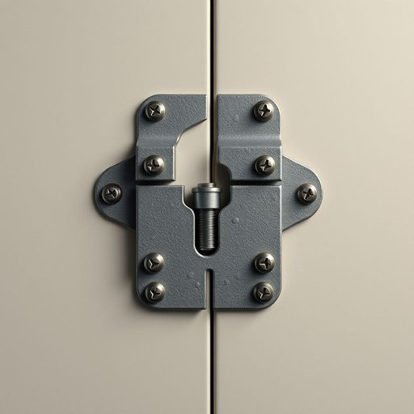

# hasp

<h1 style="font-size: 2.5em; font-weight: 300; letter-spacing: 2px; margin: 0; color: #2c3e50;">
/hasp*/
</h1>

---

---

## 例句

Before we install the new garden shed, we should check whether the hasp, which secures the door and is made of heavy-duty galvanized steel, is properly fixed with tamper-proof screws to ensure it won’t be easily forced open by intruders or strong winds.

*Before(/ˌbiˈfɔr/) we(/wi/) install(/ˌɪnˈstɔl/) the(/ðə/) new(/nu/) garden(/ˈgɑrdən/) shed,(/ʃɛd,/) we(/wi/) should(/ʃʊd/) check(/ʧɛk/) whether(/ˈwɛðər/) the(/ðə/) hasp,(/hasp*,/) which(/wɪʧ/) secures(/sɪˈkjʊrz/) the(/ðə/) door(/dɔr/) and(/ənd/) is(/ɪz/) made(/meɪd/) of(/əv/) heavy-duty(/heavy-duty*/) galvanized(/ˈgælvəˌnaɪzd/) steel,(/stil,/) is(/ɪz/) properly(/ˈprɑpərli/) fixed(/fɪkst/) with(/wɪθ/) tamper-proof(/tamper-proof*/) screws(/skruz/) to(/tɪ/) ensure(/ɪnˈʃʊr/) it(/ɪt/) won’t(/won’t*/) be(/bi/) easily(/ˈizəli/) forced(/fɔrst/) open(/ˈoʊpən/) by(/baɪ/) intruders(/ˌɪnˈtrudərz/) or(/ər/) strong(/strɔŋ/) winds.(/wɪndz./)*

**翻译：** 在安装新的花园工具棚之前，我们应当检查门锁扣——由高强度镀锌钢制成、用于固定门扇的部件——是否已用防撬螺丝牢固固定，以确保其不会被入侵者轻易强行打开或被大风吹开。

---

## 解释

英语单词“hasp”作为名词，主要指一种用于锁具上的铰链或搭扣，通常是一条金属片，其一端固定在门、箱或柜子上，另一端设有孔或槽，与挂锁或螺栓配合使用以实现锁闭功能。在家居生活用品的语境中，hasp常见于门窗安全、储物箱架或工具箱等地方，起到固定和保护物品的作用。英语学习者在使用“hasp”时需要注意，它通常用于表示具体的物理部件，多与动词“fasten”（固定）、“lock”（锁上）、“secure”（确保安全）等搭配，如“fasten the hasp”，“lock the hasp with a padlock”（用挂锁锁上搭扣）。语法上，“hasp”是可数名词，复数形式为“hasps”，表达多个此类搭扣。词源上，“hasp”源自中古英语，可能起源于古英语“hæsp”，其词义与现代含义相近，反映了古代锁具结构的演变。在中文语境中，“hasp”准确翻译为“搭扣”或“锁扣”，通常指带孔可搭配挂锁的金属片，与门窗或箱柜的锁具部分对应，帮助实现物品的安全锁闭。该词无特殊褒贬色彩，属于中性且技术性的家居生活用语，在描述门窗安全配件时使用较多，理解时应结合具体的锁具结构和使用场合。

---

<small style="color: #999; font-size: 0.9em;">2025-07-17 06:22:40</small>

