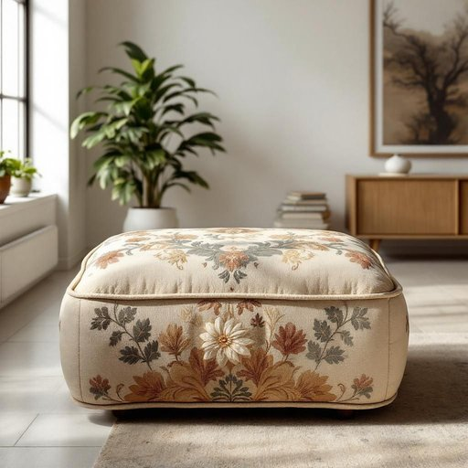

# hassock

<h1 style="font-size: 2.5em; font-weight: 300; letter-spacing: 2px; margin: 0; color: #2c3e50;">
/hassock*/
</h1>

---

---

## 例句

After rearranging the living room to create a cozier atmosphere for our weekly family movie nights, the vintage hassock, which my grandmother had meticulously embroidered decades ago, not only serves as a comfortable footrest but also cleverly doubles as additional seating when we have unexpected guests.

*After(/ˈæftər/) rearranging(/ˌriərˈeɪnʤɪŋ/) the(/ðə/) living(/ˈlɪvɪŋ/) room(/rum/) to(/tɪ/) create(/kriˈeɪt/) a(/ə/) cozier(/ˈkoʊziər/) atmosphere(/ˈætməsˌfɪr/) for(/fər/) our(/ɑr/) weekly(/ˈwikli/) family(/ˈfæməli/) movie(/ˈmuvi/) nights,(/naɪts,/) the(/ðə/) vintage(/ˈvɪntɪʤ/) hassock,(/hassock*,/) which(/wɪʧ/) my(/maɪ/) grandmother(/ˈgrændˌməðər/) had(/hæd/) meticulously(/məˈtɪkjələsli/) embroidered(/ɛmˈbrɔɪdərd/) decades(/ˈdɛkeɪdz/) ago,(/əˈgoʊ,/) not(/nɑt/) only(/ˈoʊnli/) serves(/sərvz/) as(/ɛz/) a(/ə/) comfortable(/ˈkəmfərtəbəl/) footrest(/footrest*/) but(/bət/) also(/ˈɔlsoʊ/) cleverly(/ˈklɛvərli/) doubles(/ˈdəbəlz/) as(/ɛz/) additional(/əˈdɪʃənəl/) seating(/ˈsitɪŋ/) when(/wɪn/) we(/wi/) have(/hæv/) unexpected(/ˌənɪkˈspɛktɪd/) guests.(/gɛsts./)*

**翻译：** 在重新布置客厅以营造一个更加温馨的氛围，供我们每周的家庭电影之夜使用时，那只祖母数十年前精心绣制的复古脚凳不仅成为了舒适的脚踏，还巧妙地兼作临时座椅，以备不时之需。

---

## 解释

英语单词"hassock"在家居生活用品的语境中作为名词，指的是一种厚垫子或小坐垫，通常呈圆形或方形，用来跪坐或当作脚凳使用。它常见于教堂等宗教场所，人们跪拜时会用到，也可以出现在家庭中，特别是在客厅或起居室，用作脚凳或者临时的座椅。"Hassock"一词在使用时通常作为可数名词，常见搭配包括“a hassock for kneeling”（用来跪坐的垫子）、“foot hassock”（脚凳）等，学习者应注意其通常指较厚和较大的垫子，而非普通的薄坐垫。语法上，无特殊变化，但需留意其单复数形式keysock/hassocks。词源上，"hassock"源自中古英语，最初指的是用草或其他软材料填充的垫子，可能与古英语“hasuc”相关，体现了其实用性和舒适性的特点。在中文语境中，"hassock"可译为“跪垫”、“脚凳”或“厚垫子”，具体翻译应根据使用场合确定，强调其厚实和供跪坐的功能。就文化内涵而言，"hassock"在西方特别是基督教文化中较为常见，因与礼拜活动相关带有一定的庄重和宗教氛围，不带贬义，也无明显褒义，多为实用性描述词汇。总的来说，"hassock"在家居用品中是一种专指厚实、用于跪坐或支撑脚部的垫子，学习者使用时应结合具体语境和用途准确理解和运用。

---

<small style="color: #999; font-size: 0.9em;">2025-07-17 06:22:40</small>

