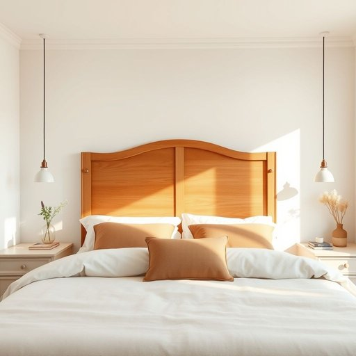

# headboard

<h1 style="font-size: 2.5em; font-weight: 300; letter-spacing: 2px; margin: 0; color: #2c3e50;">
/ˈhɛdˌbɔrd/
</h1>

---

---

## 例句

After debating for weeks whether to invest in a new mattress or fix the creaky bed frame, we finally agreed that replacing the ornate headboard, which not only adds a vintage charm to the bedroom but also provides sturdy support for reading in bed, would be the most practical and aesthetically pleasing upgrade to our sleeping space.

*After(/ˈæftər/) debating(/dəˈbeɪtɪŋ/) for(/fər/) weeks(/wiks/) whether(/ˈwɛðər/) to(/tɪ/) invest(/ˌɪnˈvɛst/) in(/ɪn/) a(/ə/) new(/nu/) mattress(/ˈmætrəs/) or(/ər/) fix(/fɪks/) the(/ðə/) creaky(/ˈkriki/) bed(/bɛd/) frame,(/freɪm,/) we(/wi/) finally(/ˈfaɪnəli/) agreed(/əˈgrid/) that(/ðət/) replacing(/rɪˈpleɪsɪŋ/) the(/ðə/) ornate(/ɔrˈneɪt/) headboard,(/ˈhɛdˌbɔrd,/) which(/wɪʧ/) not(/nɑt/) only(/ˈoʊnli/) adds(/ædz/) a(/ə/) vintage(/ˈvɪntɪʤ/) charm(/ʧɑrm/) to(/tɪ/) the(/ðə/) bedroom(/ˈbɛˌdrum/) but(/bət/) also(/ˈɔlsoʊ/) provides(/prəˈvaɪdz/) sturdy(/ˈstərdi/) support(/səˈpɔrt/) for(/fər/) reading(/ˈrɛdɪŋ/) in(/ɪn/) bed,(/bɛd,/) would(/wʊd/) be(/bi/) the(/ðə/) most(/moʊst/) practical(/ˈpræktɪkəl/) and(/ənd/) aesthetically(/ɛsˈθɛtɪkli/) pleasing(/ˈplizɪŋ/) upgrade(/ˈəpˈgreɪd/) to(/tɪ/) our(/ɑr/) sleeping(/sˈlipɪŋ/) space.(/speɪs./)*

**翻译：** 经过数周的讨论，究竟是投资购买一张新床垫，还是修理吱吱作响的床架，我们最终一致认为，替换那款既为卧室增添复古魅力，又能为床上阅读提供坚实支撑的雕花床头板，将是对睡眠空间最实用且美观的升级。

---

## 解释

单词“headboard”在家居生活用品语境中作为名词，指的是床头板，即固定在床头或家具床架上，用于支撑床垫并装饰床铺的板或框架。其具体使用场合通常是在描述卧室家具布置、床的组成部分，或购物和装修时选择床具配件时出现。英语学习者需要注意，“headboard”通常作可数名词使用，常见搭配包括“一块木制床头板”、“一块软包床头板”、“将床头板安装到床上”等。此外，headboard常与bedroom、bedframe、bedstead等词连用，表达更完整的卧室陈设。词源方面，“headboard”由“head”（头部）与“board”（板）合成，意指“放置在床头的板”，反映其基本功能和位置。中文语境中，“headboard”准确翻译为“床头板”或“床头柜板”，强调其作为床具部件的功能和位置，且无特殊褒贬含义或文化负载，只是一个中性实物名称。在实际使用时需注意与类似词如“footboard”（床尾板）区分，避免混淆。整体而言，headboard为家居词汇中较具体且常用的家具词，掌握其含义和搭配有助于准确表达卧室布置和家具相关内容。

---

<small style="color: #999; font-size: 0.9em;">2025-07-17 06:22:40</small>

