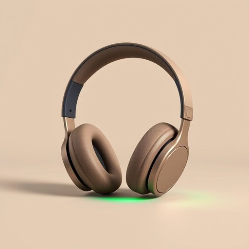

# headphone

<h1 style="font-size: 2.5em; font-weight: 300; letter-spacing: 2px; margin: 0; color: #2c3e50;">
/ˈhɛdˌfoʊn/
</h1>

---

---

## 例句

Although the headphone, which was originally designed for studio use, provides exceptional sound quality and comfort, many users find it cumbersome for everyday commuting because of its bulkiness and weight.

*Although(/ˌɔlˈðoʊ/) the(/ðə/) headphone,(/ˈhɛdˌfoʊn,/) which(/wɪʧ/) was(/wɑz/) originally(/ərˈɪʤənəli/) designed(/dɪˈzaɪnd/) for(/fər/) studio(/ˈstudiˌoʊ/) use,(/juz,/) provides(/prəˈvaɪdz/) exceptional(/ɪkˈsɛpʃənəl/) sound(/saʊnd/) quality(/kˈwɑləti/) and(/ənd/) comfort,(/ˈkəmfərt,/) many(/ˈmɛni/) users(/ˈjuzərz/) find(/faɪnd/) it(/ɪt/) cumbersome(/ˈkəmbərsəm/) for(/fər/) everyday(/ˈɛvriˈdeɪ/) commuting(/kəmˈjutɪŋ/) because(/bɪˈkəz/) of(/əv/) its(/ɪts/) bulkiness(/bulkiness*/) and(/ənd/) weight.(/weɪt./)*

**翻译：** 虽然这款耳机最初是为录音室使用而设计，拥有卓越的音质和佩戴舒适度，但由于体积大且较重，许多用户觉得它在日常通勤时使用不够便捷。

---

## 解释

英语单词headphone在家居生活用品的语境中，作为名词主要指供个人聆听音频设备如音乐、电话、视频等使用的耳机，通常是覆盖或插入耳朵的两只耳罩，方便用户在家庭环境中享受私密的声音体验，具体使用场合包括在家看电视、听音乐、玩游戏或进行远程通话时使用，强调的是便携性和舒适性。英语学习者使用该词时应注意其复数形式常用作headphones，因为通常是一对耳机，同时搭配常见短语如wireless headphones无线耳机、noise-cancelling headphones降噪耳机以及put on/take off headphones戴上/摘下耳机等，表达时注意headphone通常不可单独指一只耳机，而是整体设备。词源方面，headphone由head头部和phone声音、声音设备组成，起源于20世纪初，用以描述佩戴在头部听音的装置。中文语境中，headphone准确翻译为耳机，但需要区别于耳塞或耳麦等更具体的类型，侧重覆盖耳朵的听音设备。该词一般无褒贬色彩或特殊文化内涵，属于中性词，强调的是个人听音工具的功能和用途。

---

<small style="color: #999; font-size: 0.9em;">2025-07-17 06:22:40</small>

