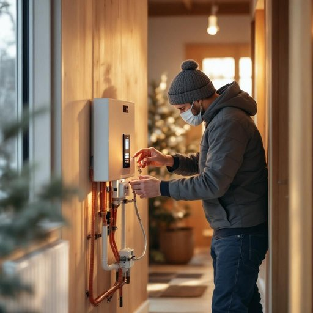

# heating

<h1 style="font-size: 2.5em; font-weight: 300; letter-spacing: 2px; margin: 0; color: #2c3e50;">
/ˈhitɪŋ/
</h1>

---

---

## 例句

Considering the unusually cold winter we've been having, I think it would be wise to get the heating system serviced before it breaks down completely, especially since the unit not only warms the entire house efficiently but also helps reduce dampness, which has been a persistent issue in the downstairs hallway.

*Considering(/kənˈsɪdərɪŋ/) the(/ðə/) unusually(/ənˈjuˌʒuəli/) cold(/koʊld/) winter(/ˈwɪntər/) we've(/wiv/) been(/bɪn/) having,(/ˈhævɪŋ,/) I(/aɪ/) think(/θɪŋk/) it(/ɪt/) would(/wʊd/) be(/bi/) wise(/waɪz/) to(/tɪ/) get(/gɪt/) the(/ðə/) heating(/ˈhitɪŋ/) system(/ˈsɪstəm/) serviced(/ˈsərvɪst/) before(/ˌbiˈfɔr/) it(/ɪt/) breaks(/breɪks/) down(/daʊn/) completely,(/kəmˈplitli,/) especially(/əˈspɛʃəli/) since(/sɪns/) the(/ðə/) unit(/ˈjunɪt/) not(/nɑt/) only(/ˈoʊnli/) warms(/wɔrmz/) the(/ðə/) entire(/ɪnˈtaɪər/) house(/haʊs/) efficiently(/ɪˈfɪʃəntli/) but(/bət/) also(/ˈɔlsoʊ/) helps(/hɛlps/) reduce(/rɪˈdus/) dampness,(/ˈdæmpnɪs,/) which(/wɪʧ/) has(/həz/) been(/bɪn/) a(/ə/) persistent(/pərˈsɪstənt/) issue(/ˈɪʃu/) in(/ɪn/) the(/ðə/) downstairs(/ˈdaʊnˈstɛrz/) hallway.(/ˈhɔlˌweɪ./)*

**翻译：** 鉴于我们这个异常寒冷的冬天，我认为在暖气系统彻底坏掉之前进行检修是明智之举。尤其是这台设备不仅能高效地为整个房屋供暖，还能帮助减少潮湿问题，而楼下走廊的潮湿一直是个顽固难题。

---

## 解释

热力学第二定律描述了孤立系统中熵总是趋向增加的趋势，意味着能量转移过程中不可避免的能量损失和系统无序度的增加，限制了能量转换的效率。该定律指出，自然过程具有时间方向性，无法自发逆转，体现了物理过程的不可逆性。热力学第二定律常用表述包括克劳修斯表述和开尔文-普朗克表述，前者强调热量无法从低温物体自发传递到高温物体，后者指出不可能从单一热源完全转换热能为机械功，均揭示了能量转换的本质限制及效率极限。这一定律在工程和科学领域广泛应用，指导热机设计、能源利用以及理解自然现象的热力学行为，同时它也基于统计力学对分子运动的统计规律解释了宏观熵增现象，是连接微观与宏观物理规律的关键原理。

---

<small style="color: #999; font-size: 0.9em;">2025-07-17 06:22:40</small>

