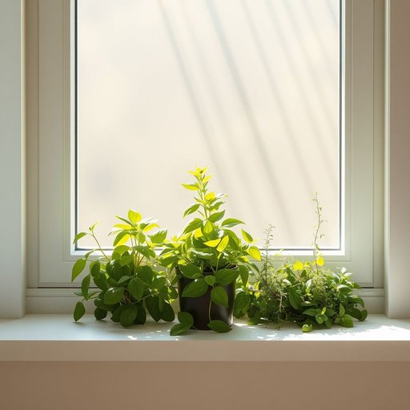

# herb

<h1 style="font-size: 2.5em; font-weight: 300; letter-spacing: 2px; margin: 0; color: #2c3e50;">
/ərb/
</h1>

---

---

## 例句

Could you please pass me that little pot with the fresh herb on the windowsill, which is thriving next to the basil and thyme, so I can chop some finely and add it to the roast before it goes into the oven?

*Could(/kʊd/) you(/ju/) please(/pliz/) pass(/pæs/) me(/mi/) that(/ðət/) little(/ˈlɪtəl/) pot(/pɑt/) with(/wɪθ/) the(/ðə/) fresh(/frɛʃ/) herb(/ərb/) on(/ɔn/) the(/ðə/) windowsill,(/windowsill*,/) which(/wɪʧ/) is(/ɪz/) thriving(/θˈraɪvɪŋ/) next(/nɛkst/) to(/tɪ/) the(/ðə/) basil(/ˈbæzəl/) and(/ənd/) thyme,(/θaɪm,/) so(/soʊ/) I(/aɪ/) can(/kən/) chop(/ʧɑp/) some(/səm/) finely(/ˈfaɪnli/) and(/ənd/) add(/æd/) it(/ɪt/) to(/tɪ/) the(/ðə/) roast(/roʊst/) before(/ˌbiˈfɔr/) it(/ɪt/) goes(/goʊz/) into(/ˈɪntu/) the(/ðə/) oven?(/ˈəvən?/)*

**翻译：** 你能把窗台上那盆生长得很茂盛、靠近罗勒和百里香的小盆栽递给我吗？我想把它切碎些，放进烤肉里再送进烤箱。

---

## 解释

英语单词“herb”在家居生活用品的语境下，作为名词主要指的是用于烹饪、调味、药用或装饰的植物，通常是叶子柔软、多香气的草本植物，如罗勒(basil)、迷迭香(rosemary)、薄荷(mint)等。使用场合多见于厨房、花园、健康护理或室内绿植布置时，例如“fresh herbs for cooking”（烹饪用的新鲜香草）或“an indoor herb garden”（室内香草园）。英语学习者需注意“herb”作为可数名词时复数形式为“herbs”，且它通常指具体的植物种类。此外，“herb”在美式英语中h发音（/ɜːrb/），而在英式英语通常不发音h（/ɜːb/），这点在听力和口语表现中需注意。常见搭配有“culinary herbs”（烹饪香草）、“medicinal herbs”（药用香草）和“fresh/dried herbs”（新鲜/干燥香草）等，有时也与“spices”（香料）作对比，香草多指叶类植物而香料多为种子、根或树皮。词源上，“herb”来源于拉丁语“herba”，意指草或植物，传入古法语“herbe”，最后进入英语，反映了其植物性和自然属性。中文语境中，“herb”通常译为“香草”或“药草”，根据具体功能和用途区别使用，但在日常生活中多指烹饪用的香草植物，需避免与中药材中的“草药”泛化混淆。整体而言，“herb”一词在家居及生活用品领域无褒贬色彩，更多体现自然、健康、绿色生活的文化内涵，且在现代养生和烹饪文化中有积极正面的象征意义。

---

<small style="color: #999; font-size: 0.9em;">2025-07-17 06:22:40</small>

