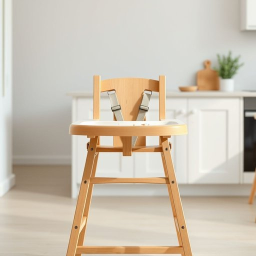

# highchair

<h1 style="font-size: 2.5em; font-weight: 300; letter-spacing: 2px; margin: 0; color: #2c3e50;">
/highchair*/
</h1>

---

---

## 例句

After carefully assembling the highchair, which we bought last weekend to ensure our little one could safely join us at the dining table during meal times, I made sure to clean every crevice thoroughly, knowing how easily crumbs and spills tend to accumulate in the straps and tray.

*After(/ˈæftər/) carefully(/ˈkɛrfəli/) assembling(/əˈsɛmbəlɪŋ/) the(/ðə/) highchair,(/highchair*,/) which(/wɪʧ/) we(/wi/) bought(/bɔt/) last(/læst/) weekend(/ˈwiˌkɪnd/) to(/tɪ/) ensure(/ɪnˈʃʊr/) our(/ɑr/) little(/ˈlɪtəl/) one(/wən/) could(/kʊd/) safely(/ˈseɪfli/) join(/ʤɔɪn/) us(/ˈjuˈɛs/) at(/æt/) the(/ðə/) dining(/ˈdaɪnɪŋ/) table(/ˈteɪbəl/) during(/ˈdʊrɪŋ/) meal(/mil/) times,(/taɪmz,/) I(/aɪ/) made(/meɪd/) sure(/ʃʊr/) to(/tɪ/) clean(/klin/) every(/ˈɛvəri/) crevice(/ˈkrɛvəs/) thoroughly,(/ˈθəroʊli,/) knowing(/noʊɪŋ/) how(/haʊ/) easily(/ˈizəli/) crumbs(/krəmz/) and(/ənd/) spills(/spɪlz/) tend(/tɛnd/) to(/tɪ/) accumulate(/əˈkjumjəˌleɪt/) in(/ɪn/) the(/ðə/) straps(/stræps/) and(/ənd/) tray.(/treɪ./)*

**翻译：** 在仔细组装好我们上周末购买的高脚椅后，为了确保宝贝在用餐时能够安全地与我们共享餐桌，我特意认真清洁了每一个缝隙，因为我深知面包屑和洒落的食物很容易积聚在安全带和餐盘上。

---

## 解释

单词“highchair”作为名词，主要指家居生活用品中的一种专为婴幼儿设计的高脚椅，通常配备托盘，用于让婴儿安全地坐在餐桌旁进食或活动，使用场合多见于家庭厨房或餐厅，特别是在婴儿开始添加辅食阶段；英语学习者使用“highchair”时应注意其作为可数名词的单复数形式（复数为“highchairs”），常见搭配包括“sit in a highchair”（坐在高脚椅上）、“feed the baby in a highchair”（在高脚椅上喂婴儿）等，表达时可用作“put/carry a child into/out of the highchair”，语法上通常不冠以冠词时指泛指，高脚椅一词源于“high”（高的）与“chair”（椅子）的组合，反映其设计特点，即比普通椅子更高便于成人操作喂食或照顾婴儿，从历史角度看，随着婴幼儿护理理念的发展，高脚椅成为普及且实用的儿童家具之一；在中文语境中，“highchair”对应准确翻译为“婴儿餐椅”或“高脚椅”，强调其功能性和针对性，属于中性词汇，无特殊褒贬含义，文化上体现了西方家庭对婴幼儿饮食安全和便利性的重视，总体而言，“highchair”是现代家庭育儿生活中常见且重要的婴儿辅助用具。

---

<small style="color: #999; font-size: 0.9em;">2025-07-17 06:22:40</small>

