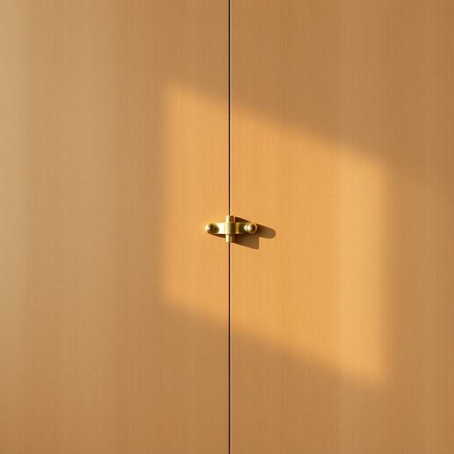

# hinge

<h1 style="font-size: 2.5em; font-weight: 300; letter-spacing: 2px; margin: 0; color: #2c3e50;">
/hɪnʤ/
</h1>

---

---

## 例句

The cupboard door, which had been creaking annoyingly every time we opened it, finally came loose yesterday because one of the hinges, worn down from years of constant use and exposed to occasional dampness, had completely given way.

*The(/ðə/) cupboard(/ˈkəbərd/) door,(/dɔr,/) which(/wɪʧ/) had(/hæd/) been(/bɪn/) creaking(/ˈkrikɪŋ/) annoyingly(/annoyingly*/) every(/ˈɛvəri/) time(/taɪm/) we(/wi/) opened(/ˈoʊpənd/) it,(/ɪt,/) finally(/ˈfaɪnəli/) came(/keɪm/) loose(/lus/) yesterday(/ˈjɛstərˌdeɪ/) because(/bɪˈkəz/) one(/wən/) of(/əv/) the(/ðə/) hinges,(/ˈhɪnʤɪz,/) worn(/wɔrn/) down(/daʊn/) from(/frəm/) years(/jɪrz/) of(/əv/) constant(/ˈkɑnstənt/) use(/juz/) and(/ənd/) exposed(/ɪkˈspoʊzd/) to(/tɪ/) occasional(/ɔˈkeɪʒənəl/) dampness,(/ˈdæmpnɪs,/) had(/hæd/) completely(/kəmˈplitli/) given(/ˈgɪvɪn/) way.(/weɪ./)*

**翻译：** 那个柜门每次开都会发出恼人的吱吱声，昨天终于脱落了，因为一只铰链多年来经受不断使用和偶尔潮湿的侵蚀，已经完全损坏了。

---

## 解释

英语单词“hinge”作为名词，在家居生活用品的语境中通常指门、窗、柜子等家具或装置上连接两部分并允许其旋转或开启的铰链或合页。这种物品广泛应用于日常家居中，帮助门窗实现开启与关闭的功能，常见于家具修理、安装或描述家居结构时使用。英语学习者使用“hinge”时需注意其常见的搭配，如“door hinge”（门铰链）、“window hinge”（窗户合页）、“cabinet hinge”（柜子铰链）等，且“hinge”在句中多为可数名词，需与冠词和复数形式搭配使用；此外，常用的固定表达还有“on the hinges of”（依靠…铰链）、“loose hinge”（松动的铰链）等。在语法上，“hinge”作为名词通常作为主语、宾语或介词短语的中心词出现，需与相应的动词和修饰语搭配。词源方面，“hinge”源自中古英语“hinge”，其更早的起源追溯到古英语“hin̄g”或“hangian”，意为悬挂或挂起，反映其连接并使物体能旋转的功能。在中文语境中，“hinge”准确可译为“铰链”或“合页”，这两个词均指可转动连接部件，不同地区用法略有差异，但含义基本一致，均强调其机械连接与转动作用。此词本身无褒贬色彩或特殊文化内涵，属于中性、实物描述词汇，使用时重点在于理解其作为连接与转动机制的功能属性。

---

<small style="color: #999; font-size: 0.9em;">2025-07-17 06:22:40</small>

