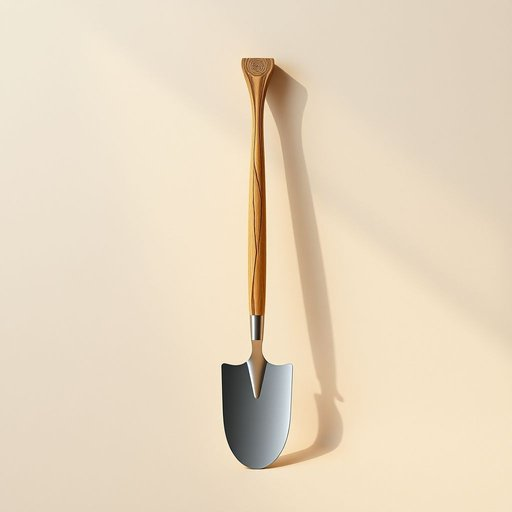

# hoe

<h1 style="font-size: 2.5em; font-weight: 300; letter-spacing: 2px; margin: 0; color: #2c3e50;">
/hoʊ/
</h1>

---

---

## 例句

After a long discussion about the impact of climate change, the committee agreed that the evidence presented in the report was crucial for developing effective policies.

*After(/ˈæftər/) a(/ə/) long(/lɔŋ/) discussion(/dɪˈskəʃən/) about(/əˈbaʊt/) the(/ðə/) impact(/ˌɪmˈpækt/) of(/əv/) climate(/ˈklaɪmɪt/) change,(/ʧeɪnʤ,/) the(/ðə/) committee(/kəˈmɪti/) agreed(/əˈgrid/) that(/ðət/) the(/ðə/) evidence(/ˈɛvədəns/) presented(/pərˈzɛnəd/) in(/ɪn/) the(/ðə/) report(/rɪˈpɔrt/) was(/wɑz/) crucial(/ˈkruʃəl/) for(/fər/) developing(/dɪˈvɛləpɪŋ/) effective(/ˈifɛktɪv/) policies.(/ˈpɑləsiz./)*

**翻译：** 经过长时间关于气候变化影响的讨论，委员会一致认为报告中提供的证据对于制定有效政策至关重要。

---

## 解释

英语单词'hoe'作为名词在家居生活用品的语境中，指的是一种园艺工具，中文一般译为“锄头”或“锄”，主要用于松土、除草和翻土，特别适合家庭花园或农田的小面积耕作。这种工具通常由一根长柄和一个扁平的金属锄头组成，适合手工使用，常见于园艺、农业或家庭园林养护场合。英语学习者在使用该词时应注意其为可数名词，通常用单数或复数形式hoes来表示多个锄头，常见搭配有garden hoe（园艺锄）、hand hoe（手锄）等，表达时常与动词如use a hoe（使用锄头）、dig with a hoe（用锄头挖土）搭配。该词来源于中古英语“ho”，“hoe”一词起源较早，源自古英语“hō”，与北欧语言有共同渊源，反映了其作为基本农具的传统用途和历史长久性。在中文语境中应准确理解为园艺或农业用的锄头工具，避免与动词“hoe”（俚语中有贬义含义，意为“卖淫者”）混淆。总的来说，'hoe'作为家居生活用品名词使用时，属于中性无褒贬的园艺工具词汇，需根据具体语境区分其正面工具意义与非正式、俚语含义，确保表达得体与准确。

---

<small style="color: #999; font-size: 0.9em;">2025-07-17 06:22:40</small>

