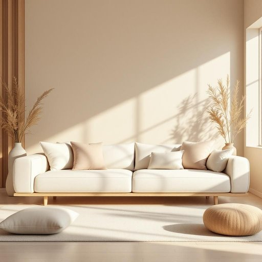

# home

<h1 style="font-size: 2.5em; font-weight: 300; letter-spacing: 2px; margin: 0; color: #2c3e50;">
/hoʊm/
</h1>

---

---

## 例句

After the meticulous rearrangement of the living room furniture, complemented by the perfect cushions that harmonized with the muted tones of our walls, the space was transformed into a cozy sanctuary where every detail invited relaxation and warmth.

*After(/ˈæftər/) the(/ðə/) meticulous(/məˈtɪkjələs/) rearrangement(/riərˈeɪnʤmənt/) of(/əv/) the(/ðə/) living(/ˈlɪvɪŋ/) room(/rum/) furniture,(/ˈfərnɪʧər,/) complemented(/ˈkɑmpləˌmɛntɪd/) by(/baɪ/) the(/ðə/) perfect(/ˈpərˌfɪkt/) cushions(/ˈkʊʃənz/) that(/ðət/) harmonized(/ˈhɑrməˌnaɪzd/) with(/wɪθ/) the(/ðə/) muted(/mˈjutɪd/) tones(/toʊnz/) of(/əv/) our(/ɑr/) walls,(/wɔlz,/) the(/ðə/) space(/speɪs/) was(/wɑz/) transformed(/trænsˈfɔrmd/) into(/ˈɪntu/) a(/ə/) cozy(/ˈkoʊzi/) sanctuary(/ˈsæŋkʧuˌɛri/) where(/wɛr/) every(/ˈɛvəri/) detail(/ˈditeɪl/) invited(/ˌɪnˈvaɪtɪd/) relaxation(/ˌrilækˈseɪʃən/) and(/ənd/) warmth.(/wɔrmθ./)*

**翻译：** 经过细致地重新布置客厅家具，配以与墙面柔和色调相得益彰的完美靠垫，整个空间焕然一新，成为一个温馨的避风港，每一个细节都散发着宁静与温暖，令人倍感放松。

---

## 解释

英语单词“home”作为名词在家居生活用品场景中，通常指一个人或一家人居住的地方，即“家”或“住所”，强调的是生活的环境和归属感。具体使用场合包括描述居所、居家生活、家具家电等与居住相关的事物，如“go home”表示回家，“home appliances”指家用电器。英语学习者需注意，“home”作为名词时一般不可数，但在特定表达中可作为可数名词使用，例如“一家人有两个家”，且“home”作为副词和形容词时用法不同，不能混淆。此外，“home”常与动词搭配使用，如“make oneself at home”（把自己当作在自己家一样）、“home improvement”（家庭装修）、“home goods”（家居用品）等，掌握这些常见搭配有助于自然表达。词源方面，“home”来源于古英语“hām”，意指村庄、住所，带有家园的文化意味。中文语境中，“home”通常译为“家”，不仅指物理的房屋，更强调情感上的归属、安全和舒适，这与英语中“home”强调的意义高度一致。在文化内涵上，“home”常带有温馨、安定的褒义色彩，是个人生活和情感寄托的重要象征，理解这一点有助于更准确地把握其在不同语境中的使用。

---

<small style="color: #999; font-size: 0.9em;">2025-07-17 06:22:40</small>

